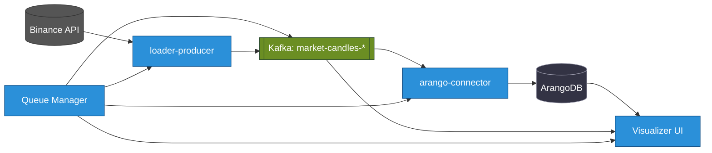

+++
date = '2025-08-26T01:30:47+02:00'
draft = false
weight = 89
title = '📌 Scaffolding StreamForge: Why We Tore  REST for a Kafka Foundation.'
[params]
  menuPre = '<i class="fa-fw fab fa-linkedin"></i> '
+++

We learned it the hard way while building **StreamForge — a real-time crypto trading platform**.  

That’s why we killed REST in favor of **100% event-driven architecture with Kafka**.  
It wasn’t just a technical choice. It was a **strategic investment in resilience, scalability, and innovation speed**.  

---

## Part 1. The Anatomy of Pain: Why synchronous systems break  

When we started StreamForge, the most obvious way was REST/gRPC. Loader calls Parser, Parser calls Writer. It worked… at first.  

But the reality of crypto markets quickly exposed the flaws.  

**Story 1. Cascading failure**  
Writer slowed down under DB pressure. Parser waited, its buffers filled. Loader stopped accepting new data. Within minutes we lost trades.  
  **Lesson:** a local problem escalated into a system-wide outage.  

**Story 2. The Distributed Monolith**  
Every service knew others’ addresses, APIs, quirks. Changing one schema caused a cascade of fixes. Flexibility vanished.  
  **Lesson:** we were building a monolith, only distributed and harder to manage.  

**Story 3. Scaling nightmare**  
We added more Parsers, but then Loader had to balance requests, retry, detect failures. Every service duplicated fault tolerance logic.  
  **Lesson:** instead of linear scaling we created chaos and technical debt.  

💡 These three moments convinced me: **synchronous design is a dead end in our domain**.  


---

## Part 2. Why we bet on Kafka  

After these lessons, it was clear: we needed a foundation that doesn’t collapse under pressure.  

**Story 1. Message queues don’t solve it**  
RabbitMQ delivered messages — but once consumed, they were gone. If a consumer crashed, we lost data or drowned in retries.  
  **Lesson:** we didn’t need a postman, we needed a *system of record*.  

**Story 2. Kafka changed our mindset**  
Producers write events. Consumers read at their pace. Kafka stores offsets and guarantees order within a key. Services don’t know each other.  
➡️ **Lesson:** we built a nervous system, not a tangle of wires.  

**Story 3. Business value**  
CEOs don’t care about APIs, they care about time-to-market. Kafka gave us exactly that: Data Science taps into `raw-trades`, Security builds fraud detection, business analytics get real-time insights — all in parallel.  
  **Lesson:** data became a *strategic asset*.  

💡 That’s when I realized: Kafka wasn’t middleware, it was **an investment in resilience, scalability, and innovation speed**.  

---

## Part 3. The Superpowers we unlocked  

**Story 1. Resilience**  
We restarted `gnn-trainer` for 10 minutes. Data kept piling up in Kafka. When it came back, it caught up from its last offset.  
  **Lesson:** a failure turned into a delay, not a catastrophe.  

**Story 2. Elasticity**  
During a Fed speech, order flow spiked 20x. Consumer lag grew. We ran:  
`kubectl scale deployment/orderbook-processor --replicas=64`  
Kafka rebalanced partitions and lag vanished.  
  **Lesson:** scaling became an operation, not a crisis.  

**Story 3. Data Mesh**  
Every topic became a product. Data Science uses `raw-trades`, Security builds `fraud-detector`. Nobody blocks anyone else.  
  **Lesson:** we achieved Data Mesh — data as a shared company-wide asset.  

---

## Conclusion  

This wasn’t “complexity for the sake of complexity”.  
It was a **strategic choice** that gave us:  
- resilience built into the architecture,  
- scalability limited only by cluster resources,  
- speed of innovation through independent services.  

We built a foundation meant to last.  
And it is **concrete-solid**.  

---

  **Resources**  
- {} Documentation: [docs.streamforge.dev](http://docs.streamforge.dev)  
- {} GitHub: [github.com/0leh-kondratov/stream-forge](https://github.com/0leh-kondratov/stream-forge)  

---

👉 Question: how does your company handle the fragility of synchronous microservices?  

#architecture #kafka #EDA #streaming #crypto #devops  