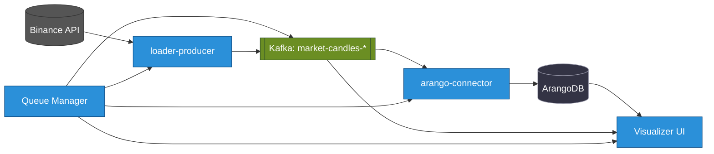
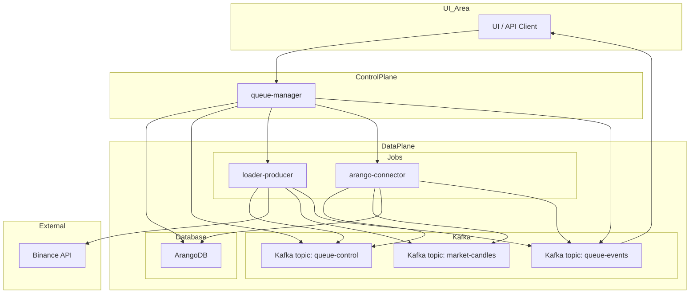

+++
date = '2025-08-25T10:01:00+02:00'
draft = false
title = 'Part I'
weight = 1
+++

# StreamForge Application Architecture

### Service Status

| Service | Version | Build | Test | Deployment |
| :--- | :---: | :---: | :--: | :----: |
| **queue-manager** |  |  |  |  |
| **dummy-service** |  |  |  |  |
| **arango-connector** |  |  |  |  |
| **loader-api-candles** |  |  |  |  |
| **loader-api-trades** |  |  |  |  |

### **Chapter 2: High-Level Application Architecture**

#### **2.1. Key Principles**

The StreamForge architecture is built on three fundamental principles that ensure its flexibility, reliability, and readiness for future challenges.

1.  **Decoupling through Events:**
    System components are not tightly coupled. Instead of direct API calls, which create fragile links, all interaction occurs asynchronously through the Kafka message broker. The `queue-manager` does not know where or how the `loader-producer` is running; it only publishes a "command" to the `queue-control` topic. Any worker that meets the criteria can take this command. This allows for independent development, updating, and scaling of each microservice without affecting other parts of the system.

2.  **Scalability:**
    The platform is designed for horizontal scaling. Workers (`loader-*`, `arango-connector`, etc.) are stateless applications launched as Kubernetes Jobs. When the load increases (for example, when it is necessary to simultaneously load data for hundreds of trading pairs), the `queue-manager` will simply create a larger number of Jobs. The use of partitions in Kafka allows for parallel data processing, and future integration with **KEDA** (Kubernetes Event-driven Autoscaling) will allow for automatic scaling of the number of consumers depending on the queue length in the topic.

3.  **Observability:**
    Understanding the state of a distributed system is critically important. In StreamForge, observability is provided by three pillars:
    *   **Metrics:** Each microservice exports metrics in Prometheus format, which are collected and visualized in Grafana. This allows for monitoring of technical parameters (CPU, memory) and business metrics (number of processed records, latency).
    *   **Logs:** All logs are collected centrally using `Fluent-bit` and sent to `Elasticsearch`, where they can be analyzed and searched through `Kibana`.
    *   **Telemetry (Business Tracing):** The `queue-events` topic acts as a distributed tracing system at the business logic level. It allows you to track the life cycle of each task from the moment it is created until its successful completion or error, passing through all the microservices involved.

#### **2.2. Architectural Diagram and Data Flow**

The diagram below illustrates the interaction of key system components as part of a historical data loading task.




**Data Flow Description (Workflow):**
1.  **Initiation:** The user sends a request to start a workflow to the `queue-manager` via the UI or API.
2.  **State Preservation:** The `queue-manager` creates a record for the new workflow in its database (ArangoDB) with the status `pending`.
3.  **Declaration of Intent:** The `queue-manager` forms and sends a `start` command to the `queue-control` topic.
4.  **Executor Launch:** The `queue-manager` creates a `Job` for each required microservice (`loader-producer`, `arango-connector`) via the Kubernetes API.
5.  **Command Reception:** The launched microservices subscribe to `queue-control` and receive the `start` command.
6.  **Data Collection:** The `loader-producer` accesses the Binance API to retrieve data.
7.  **Data Publication:** The `loader-producer` sends the received data to the corresponding data topic in Kafka (e.g., `btc-klines-1m`).
8.  **Telemetry Submission:** Both workers (`loader` and `arango-connector`) periodically send events about their status (e.g., `loading`, `records_written: 1000`) to the `queue-events` topic.
9.  **Data Consumption:** The `arango-connector` reads data from the topic.
10. **Data Persistence:** The `arango-connector` writes the data to the target collection in ArangoDB.
11. **Feedback:** The `queue-manager` listens to the `queue-events` topic to update the workflow status in its database and broadcast it to the UI via WebSocket.

### **Chapter 3: Kafka-Based Communication Model**

#### **3.1. Justification for Choosing an Event-Driven Approach**

The choice of Apache Kafka as the central nervous system of the project is not accidental. An Event-Driven Architecture (EDA) provides a number of critically important advantages over the traditional model based on direct API calls:

*   **Temporal Decoupling:** The producer (e.g., `loader-producer`) and the consumer (e.g., `arango-connector`) do not have to be online at the same time. The `loader` can send data to Kafka and finish its work. The `arango-connector` can be started later and process this data when it is convenient.
*   **Fault Tolerance:** Kafka acts as a persistent buffer. If a consumer service fails, messages are not lost, but remain in the topic until the consumer is restarted and can continue processing from where it left off.
*   **Flexibility and Extensibility:** Adding a new data handler (e.g., a service for real-time alerting) does not require changing existing components. It is enough to create a new microservice that will subscribe to the same data topic.

#### **3.2. Control Topic Specification**

All orchestration and monitoring in StreamForge are built on two service topics.

##### **`queue-control` Topic**

*   **Purpose:** Declarative sending of commands from the `queue-manager` to the workers.
*   **Producers:** `queue-manager`.
*   **Consumers:** All workers (`loader-*`, `arango-connector`, `graph-builder`, etc.).
*   **Message Format:**
    ```json
    {
      "command": "start" | "stop",
      "queue_id": "wf-btcusdt-api_candles_5m-20240801-a1b2c3",
      "target": "loader-producer",
      "symbol": "BTCUSDT",
      "type": "api_candles_5m",
      "time_range": "2024-08-01:2024-08-02",
      "kafka_topic": "wf-btcusdt-api_candles_5m-20240801-a1b2c3-data",
      "collection_name": "btcusdt_api_candles_5m_2024_08_01",
      "telemetry_id": "loader-producer__a1b2c3",
      "image": "registry.dmz.home/streamforge/loader-producer:v0.2.0",
      "timestamp": 1722500000.123
    }
    ```

##### **`queue-events` Topic**

*   **Purpose:** Centralized collection of telemetry from all microservices. It is the "pulse" of the system.
*   **Producers:** All workers.
*   **Consumers:** `queue-manager` (for updating statuses and broadcasting to the UI).
*   **Message Format:**
    ```json
    {
      "queue_id": "wf-btcusdt-api_candles_5m-20240801-a1b2c3",
      "producer": "arango-connector__a1b2c3",
      "symbol": "BTCUSDT",
      "type": "api_candles_5m",
      "status": "loading" | "finished" | "error" | "started" | "interrupted",
      "message": "Saved 15000 records",
      "records_written": 15000,
      "finished": false,
      "timestamp": 1722500125.456
    }
    ```

### **Chapter 4: Detailed Description of Microservices**

The StreamForge platform consists of a set of specialized, independent microservices, each of which performs a clearly defined function.

#### **4.1. `queue-manager`: The Central Orchestrator**

The `queue-manager` is the "brain" of the entire system. It is the only component with which the user or an external system interacts directly. It is responsible for orchestrating workflows, managing their life cycle, and interacting with other microservices via Kafka and Kubernetes.

*   **Role and Responsibilities:**
    *   **Entry Point:** Provides a REST API (based on FastAPI) for managing the life cycle of tasks (workflows): start, stop, get status.
    *   **Orchestration:** Accepts high-level requests, decomposes them into specific steps, and generates commands for each worker.
    *   **State Management:** Stores the state of all running and completed workflows in the ArangoDB database.
    *   **Kubernetes Integration:** Interacts with the Kubernetes API to dynamically create a `Job` for each worker in the workflow.
    *   **Feedback:** Subscribes to the `queue-events` telemetry topic to track the progress of tasks in real time and update their status in the UI via WebSocket.

*   **API Endpoints:**
    *   `POST /queues/start`: Starts a new queue (workflow). Accepts a detailed configuration for each microservice participating in the workflow.
        ```json
        {
          "command": "start",
          "queue_id": "loader-btcusdt-api_candles_5m-2024_06_01-abc123",
          "symbol": "BTCUSDT",
          "type": "api_candles_5m",
          "time_range": "2024-06-01:2024-06-02",
          "timestamp": 1722346211.177,
          "targets": [
            {
              "target": "loader-producer",
              "image": "registry.dmz.home/kinga/stream-forge/loader-producer:v0.1.0",
              "telemetry_id": "loader-producer__abc123",
              "kafka_topic": "loader-btcusdt-api-candles-5m-2024-06-01-abc123",
              "time_range": "2024-06-01:2024-06-02",
              "interval": "5m"
            },
            {
              "target": "arango-connector",
              "image": "registry.dmz.home/kinga/stream-forge/arango-connector:v0.1.0",
              "telemetry_id": "arango-connector__abc123",
              "kafka_topic": "loader-btcusdt-api-candles-5m-2024-06-01-abc123",
              "collection_name": "btc_candles_5m_2024_06_01"
            }
          ]
        }
        ```
    *   `POST /queues/start-test-flow`: Starts a predefined test data-flow based on templates from `test_flows.yaml`. Simplifies the launch of complex test scenarios.
        ```json
        {
          "flow_name": "historical_candles_to_arango",
          "symbol": "ETHUSDT",
          "time_range": "2024-07-01:2024-07-02",
          "extra_params": {
            "loader_image_version": "v0.1.1"
          }
        }
        ```
    *   `GET /queues/list`: Returns a list of all running and completed queues.
    *   `POST /queues/stop`: Stops the specified queue by sending a `stop` command to Kafka.

*   **Technologies:** Python, FastAPI, Pydantic, `python-kubernetes`, `aiokafka`, ArangoDB.


#### **4.2. Data Collection Layer: The `loader-*` Family**

These microservices are responsible for retrieving data from external sources (Binance) and publishing it to Kafka. They are designed as stateless workers launched as Kubernetes Jobs.

*   **`loader-producer` (base)**
    *   **Role:** Universal loader of data from external sources (e.g., Binance REST API) and its publication to Kafka.
    *   **Logic:** Works asynchronously using `asyncio` and `uvloop` for high performance. Receives configuration through environment variables. Listens to the `queue-control` topic for control commands (e.g., `stop`) and sends detailed telemetry about its status (`started`, `interrupted`, `finished`, `error`) to the `queue-events` topic.
*   **`loader-api-*` (e.g., `loader-api-candles`, `loader-api-trades`)**
    *   **Role:** Specialized loaders of historical data via REST API.
    *   **Logic:** Inherit functionality from the base `loader-producer`, focusing on retrieving data for specific types (candles, trades) and time ranges.
*   **`loader-ws-*` (e.g., `loader-ws-orderbook`)**
    *   **Role:** Specialized loaders of real-time data via WebSocket.
    *   **Logic:** Establish a persistent WebSocket connection with the source, receive a stream of events, and broadcast them to Kafka.
*   **Common Responsibilities:**
    *   Receive all configuration (symbol, data type, Kafka topic, etc.) through environment variables.
    *   Listen to the `queue-control` topic for proper shutdown on a `stop` command.
    *   Send detailed telemetry about their work to `queue-events`.
*   **Technologies:** Python, `aiohttp` (for REST), `websockets` (for WebSocket), `aiokafka`, `uvloop`, `orjson`.

#### **4.3. Data Storage Layer: The `arango-connector` Family**

These microservices act as a bridge between Kafka and the ArangoDB database.

*   **Role and Responsibilities:**
    *   **Data Consumption:** Subscribe to a specific data topic in Kafka.
    *   **Batch Writing:** Accumulate messages in a buffer and write them to ArangoDB in batches to improve performance.
    *   **Idempotency:** Use the `UPSERT` operation and a unique `_key` for each document, which guarantees no duplicates when reprocessing messages.
    *   **Error Handling:** Correctly handle invalid messages (e.g., "broken" JSON), log them, and continue working without stopping the entire pipeline.
*   **Technologies:** Python, `aioarango`, `aiokafka`.

#### **4.4. Analytical Layer: `graph-builder` and `gnn-trainer`**

This is the science-intensive part of the platform, responsible for advanced data analysis and machine learning.

*   **`graph-builder`**
    *   **Role:** Transforming tabular data (candles, trades) into a graph structure.
    *   **Logic:** Reads data from several ArangoDB collections, calculates correlations or other metrics of the relationship between assets, and builds a graph where the nodes are trading pairs and the edges are their relationships. Saves the result to a separate graph collection in ArangoDB.
*   **`gnn-trainer`**
    *   **Role:** Training graph neural network (GNN) models.
    *   **Logic:** Loads the graph built by `graph-builder`. Defines and trains a GNN model (e.g., based on `GATv2Conv`) to solve a classification or regression problem (e.g., predicting price movement). Saves the trained model and artifacts (e.g., weights, training metrics) to the `MinIO` object storage.
*   **Technologies:** Python, `aioarango`, `PyTorch`, `PyTorch Geometric (PyG)`, `minio-py`.

#### **4.5. `dummy-service`: Microservice for Testing and Simulation**

`dummy-service` is a StreamForge test microservice designed to simulate the behavior of other services, test Kafka connectivity, and debug. It can receive commands from `queue-control`, send events to `queue-events`, simulate loading and errors, and publish Prometheus metrics.

*   **Role and Responsibilities:**
    *   **Simulation:** Simulates the work of other microservices (e.g., `loader-producer`) to test end-to-end scenarios without real data.
    *   **Kafka Testing:** Used to check connectivity with Kafka via `ping/pong` commands.
    *   **Debugging:** Allows you to simulate various states (loading, error) to debug the monitoring and orchestration system.
    *   **Metrics:** Exports Prometheus metrics to monitor its behavior.
*   **Technologies:** Python, FastAPI, `aiokafka`, `loguru`, `prometheus_client`.
*   **More details:** See `services/dummy-service/README.md`.
