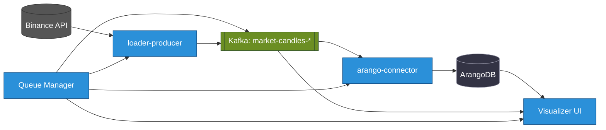

+++
date = '2025-06-13T20:14:52+02:00'
draft = true
title = 'Architecture Real-Time Cryptocurrency Data Analytics'
weight = 1
+++

### Status service

| Service | Version | Build | Test | Deploy |
| :--- | :---: | :---: | :--: | :----: |
| **queue-manager** |  |  |  |  |
| **dummy-service** |  |  |  |  |
| **arango-connector** |  |  |  |  |
| **loader-api-candles** |  |  |  |  |
| **loader-api-trades** |  |  |  |  |

# StreamForge: A High-Performance, Event-Driven Platform for Real-Time Cryptocurrency Data Analytics

**StreamForge** is an advanced, event-driven platform engineered for the high-throughput ingestion, processing, and analysis of real-time cryptocurrency market data. Built on a foundation of modern Cloud-Native technologies and architectural patterns, StreamForge delivers a scalable, resilient, and flexible solution for tackling the unique challenges of the digital asset landscape.

## Architecture Overview

## 1.1. The Challenge of Cryptocurrency Data

In the fast-paced world of digital assets, cryptocurrency data is the lifeblood of analytics and automated decision-making. This data is characterized by extreme volatility, 24/7 availability, and immense volume, encompassing everything from high-frequency trades to continuous order book updates. These characteristics demand a new generation of data pipelines—ones that are not only high-performance but also exceptionally reliable.

Key technical hurdles include:
- **Heterogeneous Data Ingestion:** Integrating disparate data streams from a multitude of sources, including REST APIs for historical data and WebSocket feeds for real-time market events.
- **Extreme Scalability:** Architecting a system capable of processing massive, bursty data streams without introducing latency.
- **Data Integrity and Fault Tolerance:** Ensuring guaranteed data delivery and designing for rapid, automated recovery from component failures.
- **Complex Workflow Orchestration:** Managing sophisticated, multi-stage data processing workflows, such as a "load -> persist -> build graph -> train model" sequence, in a coordinated and reliable manner.

## 1.2. The StreamForge Solution: A Decoupled, Event-Driven Architecture

StreamForge is architected as a fully event-driven platform, designed from the ground up for maximum efficiency and resilience. The core principle is the complete decoupling of of services through a central nervous system: **Apache Kafka**. Instead of direct, brittle service-to-service calls, components communicate asynchronously. Each microservice is a self-contained unit that publishes events (its work

The application of this approach guarantees high scalability, adaptability to changing requirements, and increased fault tolerance of the entire system.

## 1.3. Project Mission

1.  **Creation of a Unified Data Source:** Consolidating the processes of collecting, verifying, and storing market data to ensure prompt and convenient access to high-quality information.
2.  **Formation of an Innovative Environment for Data Science:** Providing a specialized platform for the development, testing, and validation of analytical models, including advanced Graph Neural Network (GNN) architectures.
3.  **Building a Reliable Foundation for Algorithmic Trading:** Developing a high-performance and fault-tolerant data pipeline, critically important for the functioning of automated trading systems.
4.  **Comprehensive Process Automation:** Minimizing manual intervention at all stages of the data lifecycle, from collection to analytical processing, to enhance operational efficiency.

## 1.4. Practical Use Cases

- **Scenario 1: Model Training on Historical Data.**
  - **Objective:** Train a GNN model on retrospective transaction data and aggregated 5-minute candles for the `BTCUSDT` trading pair over the last monthly period.
  - **Method:** A full data processing cycle is activated via `queue-manager`. Tasks are executed by Kubernetes Jobs: `loader-producer` loads data into Apache Kafka, `arango-connector` ensures its persistent storage in ArangoDB, `graph-builder` forms the graph structure, and `gnn-trainer` performs model training.

- **Scenario 2: Real-time Market Monitoring.**
  - **Objective:** Obtain streaming data on transactions and order book state in real-time for the `ETHUSDT` trading pair.
  - **Method:** The `loader-ws` module establishes a connection with WebSocket and transmits data to Apache Kafka. The developing visualization module subscribes to the relevant topics to display data on an interactive dashboard.

- **Scenario 3: Rapid Data Analysis.**
  - **Objective:** Verify a hypothesis regarding the correlation between trading volumes and market volatility.
  - **Method:** Using `Jupyter Server` to establish a connection with ArangoDB and conduct analytical research based on data already aggregated and processed by the StreamForge system.

These powerful functionalities make StreamForge an indispensable tool for anyone striving for maximum efficiency in working with cryptocurrency data.

## Container Images

The following Docker images are published to GitHub Container Registry (GHCR):

| Service           | Status                                                                                                                                               | Image                                                                                         | Pull command                                                                                  |
|-------------------|------------------------------------------------------------------------------------------------------------------------------------------------------|-----------------------------------------------------------------------------------------------|------------------------------------------------------------------------------------------------|
| dummy-service     |  | `ghcr.io/0leh-kondratov/dummy-service:latest`                                                 | `docker pull ghcr.io/0leh-kondratov/dummy-service:latest`                                     |
| streamforge-base  |   | `ghcr.io/0leh-kondratov/stream-forge-base:v0.1.3`                                             | `docker pull ghcr.io/0leh-kondratov/stream-forge-base:v0.1.3`                                 |

---