+++
date = '2025-08-26T01:30:47+02:00'
draft = false
weight = 89
title = '📌 Od kruchego REST do stabilnego Data Mesh: nasza strategiczna decyzja o Kafka.'
[params]
  menuPre = '<i class="fa-fw fab fa-linkedin"></i> '
+++

Nauczyliśmy się tego na własnej skórze, budując **StreamForge — platformę do handlu kryptowalutami w czasie rzeczywistym**.

Dlatego zrezygnowaliśmy z REST na rzecz **architektury w 100% opartej na zdarzeniach z Kafką**.
To nie był tylko wybór techniczny. To była **strategiczna inwestycja w odporność, skalowalność i szybkość innowacji**.

---

## Część 1. Anatomia bólu: dlaczego systemy synchroniczne zawodzą

Kiedy zaczynaliśmy StreamForge, najbardziej oczywistym rozwiązaniem był REST/gRPC. Loader wywołuje Parser, Parser wywołuje Writer. Na początku działało.

Ale rzeczywistość rynków kryptowalut szybko obnażyła wady.

**Historia 1. Kaskadowa awaria**
Writer zwalniał pod presją bazy danych. Parser czekał, jego bufory się zapełniały. Loader przestał przyjmować nowe dane. W ciągu kilku minut straciliśmy transakcje.
  **Lekcja:** lokalny problem przerodził się w awarię całego systemu.

**Historia 2. Monolit rozproszony**
Każda usługa znała adresy, API i dziwactwa innych. Zmiana jednego schematu powodowała kaskadę poprawek. Elastyczność zniknęła.
  **Lekcja:** budowaliśmy monolit, tylko rozproszony i trudniejszy w zarządzaniu.

**Historia 3. Koszmar skalowania**
Dodaliśmy więcej Parserów, ale wtedy Loader musiał równoważyć żądania, ponawiać próby, wykrywać awarie. Każda usługa powielała logikę odporności na błędy.
  **Lekcja:** zamiast liniowego skalowania stworzyliśmy chaos i dług techniczny.

💡 Te trzy momenty przekonały mnie: **projektowanie synchroniczne to ślepy zaułek w naszej dziedzinie**.


---

## Część 2. Dlaczego postawiliśmy na Kafkę

Po tych lekcjach stało się jasne: potrzebowaliśmy fundamentu, który nie zawali się pod presją.

**Historia 1. Kolejki komunikatów nie rozwiązują problemu**
RabbitMQ dostarczał komunikaty — ale po ich przetworzeniu znikały. Jeśli konsument uległ awarii, traciliśmy dane lub tonęliśmy w ponownych próbach.
  **Lekcja:** nie potrzebowaliśmy listonosza, potrzebowaliśmy *systemu zapisu*.

**Historia 2. Kafka zmieniła nasze myślenie**
Producenci zapisują zdarzenia. Konsumenci czytają je w swoim tempie. Kafka przechowuje offsety i gwarantuje kolejność w ramach klucza. Usługi nie wiedzą o sobie nawzajem.
➡️ **Lekcja:** zbudowaliśmy system nerwowy, a nie plątaninę kabli.

**Historia 3. Wartość biznesowa**
Dyrektorzy generalni nie dbają o API, dbają o czas wprowadzenia produktu na rynek. Kafka dała nam dokładnie to: Data Science korzysta z `raw-trades`, Security buduje wykrywanie oszustw, analityka biznesowa uzyskuje wgląd w czasie rzeczywistym — wszystko równolegle.
  **Lekcja:** dane stały się *strategicznym zasobem*.

💡 Wtedy zdałem sobie sprawę: Kafka nie była oprogramowaniem pośredniczącym, to była **inwestycja w odporność, skalowalność i szybkość innowacji**.

```mermaid
%% StreamForge — Cykl życia danych (poprawiony)
%% Zmiany: bezpieczne etykiety, zachowaj gwiazdkę tylko wewnątrz etykiety węzła
flowchart LR
    B[(Binance API)]:::ext --> LP[loader-producer]:::svc
    QM[Queue Manager]:::svc --> K
    LP --> K[[Kafka: market-candles-*]]:::topic
    K --> AC[arango-connector]:::svc
    A --> VIS[Visualizer UI]:::svc
    K --> VIS
    QM --> VIS
    QM --> AC
    QM --> LP
    AC --> A[(ArangoDB)]:::core

classDef svc fill:#2B90D9,stroke:#0E4F88,color:#FFFFFF
classDef topic fill:#6B8E23,stroke:#2F4F2F,color:#FFFFFF
classDef core fill:#333344,stroke:#9999AA,color:#FFFFFF
classDef ext fill:#555555,stroke:#333333,color:#FFFFFF
```

---

## Część 3. Supermoce, które odblokowaliśmy

**Historia 1. Odporność**
Zrestartowaliśmy `gnn-trainer` na 10 minut. Dane nadal gromadziły się w Kafce. Kiedy wrócił, nadrobił zaległości od ostatniego offsetu.
  **Lekcja:** awaria zamieniła się w opóźnienie, a nie katastrofę.

**Historia 2. Elastyczność**
Podczas przemówienia prezesa Fed, przepływ zleceń wzrósł 20-krotnie. Opóźnienie konsumenta wzrosło. Uruchomiliśmy:
`kubectl scale deployment/orderbook-processor --replicas=64`
Kafka zrównoważyła partycje i opóźnienie zniknęło.
  **Lekcja:** skalowanie stało się operacją, a nie kryzysem.

**Historia 3. Data Mesh**
Każdy temat stał się produktem. Data Science używa `raw-trades`, Security buduje `fraud-detector`. Nikt nikogo nie blokuje.
  **Lekcja:** osiągnęliśmy Data Mesh — dane jako wspólny zasób całej firmy.

---

## Wniosek

To nie była „złożoność dla samej złożoności”.
To był **strategiczny wybór**, który dał nam:
- odporność wbudowaną w architekturę,
- skalowalność ograniczoną tylko zasobami klastra,
- szybkość innowacji dzięki niezależnym usługom.

Zbudowaliśmy fundament, który ma przetrwać.
I jest **solidny jak beton**.

---

  **Zasoby**
- {} Dokumentacja: [docs.streamforge.dev](http://docs.streamforge.dev)
- {} GitHub: [github.com/0leh-kondratov/stream-forge](https://github.com/0leh-kondratov/stream-forge)

---

👉 Pytanie: jak Twoja firma radzi sobie z kruchością synchronicznych mikrousług?

#architektura #kafka #EDA #streaming #krypto #devops