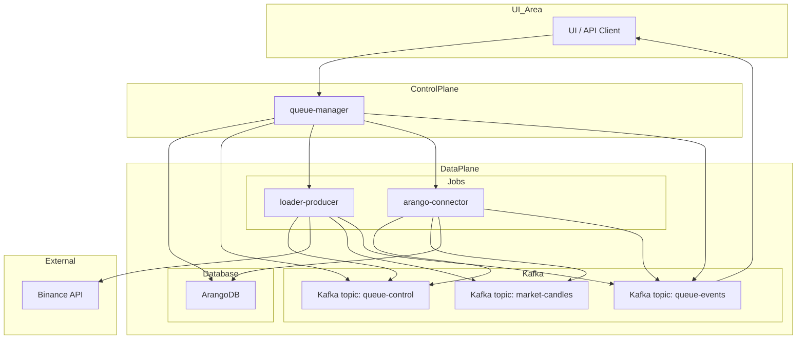

+++
date = '2025-08-25T10:01:00+02:00'
draft = false
title = 'Architektura Aplikacji StreamForge'
weight = 1
+++

# Część I: Architektura Aplikacji StreamForge

### Status Usługi

### **Rozdział 2: Architektura Aplikacji Wysokiego Poziomu**

#### **2.1. Kluczowe Zasady**

Architektura StreamForge opiera się na trzech fundamentalnych zasadach, które zapewniają jej elastyczność, niezawodność i gotowość na przyszłe wyzwania.

1.  **Rozprzężenie (Decoupling) poprzez zdarzenia:**
    Komponenty systemu nie są sztywno ze sobą powiązane. Zamiast bezpośrednich wywołań API, które tworzą kruche powiązania, cała interakcja odbywa się asynchronicznie poprzez brokera wiadomości Kafka. `queue-manager` nie wie, gdzie i jak uruchomiony jest `loader-producer`; publikuje jedynie "rozkaz" do tematu `queue-control`. Każdy worker, spełniający kryteria, może podjąć ten rozkaz do pracy. Pozwala to na niezależne rozwijanie, aktualizowanie i skalowanie każdego mikroserwisu, nie wpływając na pozostałe części systemu.

2.  **Skalowalność:**
    Platforma została zaprojektowana do skalowania horyzontalnego. Workery (`loader-*`, `arango-connector` i inne) są aplikacjami bezstanowymi, uruchamianymi jako zadania Kubernetes (Kubernetes Jobs). W przypadku zwiększenia obciążenia (np. konieczności jednoczesnego ładowania danych dla setek par handlowych) `queue-manager` po prostu utworzy większą liczbę zadań. Wykorzystanie partycji w Kafce pozwala na równoległe przetwarzanie danych, a przyszła integracja z **KEDA** (Kubernetes Event-driven Autoscaling) umożliwi automatyczne skalowanie liczby konsumentów w zależności od długości kolejki w temacie.

3.  **Obserwowalność:**
    Zrozumienie stanu rozproszonego systemu jest krytycznie ważne. W StreamForge obserwowalność zapewniają trzy filary:
    *   **Metryki:** Każdy mikroserwis eksportuje metryki w formacie Prometheus, które są zbierane i wizualizowane w Grafanie. Pozwala to na monitorowanie parametrów technicznych (CPU, pamięć) i metryk biznesowych (liczba przetworzonych rekordów, opóźnienia).
    *   **Logi:** Wszystkie logi są centralnie zbierane za pomocą `Fluent-bit` i wysyłane do `Elasticsearch`, gdzie można je analizować i wyszukiwać za pomocą `Kibana`.
    *   **Telemetria (Śledzenie Biznesowe):** Temat `queue-events` pełni rolę rozproszonego systemu śledzenia na poziomie logiki biznesowej. Pozwala on śledzić cykl życia każdego zadania od momentu jego utworzenia do pomyślnego zakończenia lub błędu, przechodząc przez wszystkie zaangażowane mikroserwisy.

#### **2.2. Schemat Architektoniczny i Przepływ Danych**

Poniższy schemat ilustruje interakcję kluczowych komponentów systemu w ramach zadania ładowania danych historycznych.



**Opis Przepływu Danych (Workflow):**
1.  **Inicjacja:** Użytkownik za pośrednictwem interfejsu użytkownika lub API wysyła żądanie uruchomienia workflow do `queue-manager`.
2.  **Zapis Stanu:** `queue-manager` tworzy wpis dla nowego workflow w swojej bazie danych (ArangoDB) ze statusem `pending`.
3.  **Deklaracja Intencji:** `queue-manager` tworzy i wysyła polecenie `start` do tematu `queue-control`.
4.  **Uruchomienie Wykonawców:** `queue-manager` za pośrednictwem API Kubernetes tworzy `Job` dla każdego wymaganego mikroserwisu (`loader-producer`, `arango-connector`).
5.  **Odbiór Polecenia:** Uruchomione mikroserwisy subskrybują `queue-control` i odbierają polecenie `start`.
6.  **Zbieranie Danych:** `loader-producer` odwołuje się do API Binance w celu pobrania danych.
7.  **Publikacja Danych:** `loader-producer` wysyła otrzymane dane do odpowiedniego tematu danych w Kafce (np. `btc-klines-1m`).
8.  **Przesyłanie Telemetrii:** Obaj workery (`loader` i `arango-connector`) okresowo wysyłają zdarzenia o swoim statusie (np. `loading`, `records_written: 1000`) do tematu `queue-events`.
9.  **Konsumpcja Danych:** `arango-connector` odczytuje dane z tematu.
10. **Trwałość Danych:** `arango-connector` zapisuje dane do docelowej kolekcji w ArangoDB.
11. **Informacja Zwrotna:** `queue-manager` nasłuchuje tematu `queue-events`, aby aktualizować status workflow w swojej bazie danych i transmitować go do interfejsu użytkownika za pośrednictwem WebSocket.

### **Rozdział 3: Model Komunikacji Oparty na Kafce**

#### **3.1. Uzasadnienie Wyboru Podejścia Sterowanego Zdarzeniami**

Wybór Apache Kafka jako centralnego układu nerwowego projektu nie jest przypadkowy. Architektura sterowana zdarzeniami (Event-Driven Architecture, EDA) zapewnia szereg krytycznie ważnych zalet w porównaniu z tradycyjnym modelem opartym na bezpośrednich wywołaniach API:

*   **Rozprzężenie Czasowe (Temporal Decoupling):** Producent (np. `loader-producer`) i konsument (np. `arango-connector`) nie muszą być online jednocześnie. `loader` może wysłać dane do Kafki i zakończyć swoją pracę. `arango-connector` może zostać uruchomiony później i przetworzyć te dane, gdy będzie to dla niego wygodne.
*   **Odporność na Awarie:** Kafka działa jako trwały bufor. Jeśli usługa konsumenta ulegnie awarii, wiadomości nie zostaną utracone, ale pozostaną w temacie, dopóki konsument nie zostanie ponownie uruchomiony i nie będzie mógł kontynuować przetwarzania od miejsca, w którym się zatrzymał.
*   **Elastyczność i Rozszerzalność:** Dodanie nowego modułu obsługi danych (np. usługi do alertowania w czasie rzeczywistym) nie wymaga zmiany istniejących komponentów. Wystarczy utworzyć nowy mikroserwis, który będzie subskrybował ten sam temat danych.

#### **3.2. Specyfikacja Tematów Sterujących**

Cała orkiestracja i monitorowanie w StreamForge opierają się na dwóch tematach usługowych.

##### **Temat `queue-control`**

*   **Przeznaczenie:** Deklaratywne wysyłanie poleceń z `queue-manager` do workerów.
*   **Producenci:** `queue-manager`.
*   **Konsumenci:** Wszyscy workery (`loader-*`, `arango-connector`, `graph-builder` itd.).
*   **Format Wiadomości:**
    ```json
    {
      "command": "start" | "stop",
      "queue_id": "wf-btcusdt-api_candles_5m-20240801-a1b2c3",
      "target": "loader-producer",
      "symbol": "BTCUSDT",
      "type": "api_candles_5m",
      "time_range": "2024-08-01:2024-08-02",
      "kafka_topic": "wf-btcusdt-api_candles_5m-20240801-a1b2c3-data",
      "collection_name": "btcusdt_api_candles_5m_2024_08_01",
      "telemetry_id": "loader-producer__a1b2c3",
      "image": "registry.dmz.home/streamforge/loader-producer:v0.2.0",
      "timestamp": 1722500000.123
    }
    ```

##### **Temat `queue-events`**

*   **Przeznaczenie:** Centralne zbieranie telemetrii ze wszystkich mikroserwisów. Jest "pulsem" systemu.
*   **Producenci:** Wszyscy workery.
*   **Konsumenci:** `queue-manager` (do aktualizacji statusów i transmisji do interfejsu użytkownika).
*   **Format Wiadomości:**
    ```json
    {
      "queue_id": "wf-btcusdt-api_candles_5m-20240801-a1b2c3",
      "producer": "arango-connector__a1b2c3",
      "symbol": "BTCUSDT",
      "type": "api_candles_5m",
      "status": "loading" | "finished" | "error" | "started" | "interrupted",
      "message": "Zapisano 15000 rekordów",
      "records_written": 15000,
      "finished": false,
      "timestamp": 1722500125.456
    }
    ```

### **Rozdział 4: Szczegółowy Opis Mikroserwisów**

Platforma StreamForge składa się z zestawu wyspecjalizowanych, niezależnych mikroserwisów, z których każdy pełni jasno określoną funkcję.

#### **4.1. `queue-manager`: Centralny Orkiestrator**

`queue-manager` jest "mózgiem" całego systemu. Jest to jedyny komponent, z którym bezpośrednio wchodzi w interakcję użytkownik lub system zewnętrzny. Odpowiada za orkiestrację procesów roboczych (workflow), zarządzanie ich cyklem życia, a także za interakcję z innymi mikroserwisami za pośrednictwem Kafki i Kubernetes.

*   **Rola i Obowiązki:**
    *   **Punkt Wejścia:** Udostępnia REST API (oparte na FastAPI) do zarządzania cyklem życia zadań (workflow): uruchamianie, zatrzymywanie, pobieranie statusu.
    *   **Orkiestracja:** Akceptuje żądania wysokiego poziomu, dekomponuje je na konkretne kroki i generuje polecenia dla każdego workera.
    *   **Zarządzanie Stanem:** Przechowuje stan wszystkich uruchomionych i zakończonych workflow w bazie danych ArangoDB.
    *   **Integracja z Kubernetes:** Współdziała z API Kubernetes w celu dynamicznego tworzenia `Job` dla każdego workera w workflow.
    *   **Informacja Zwrotna:** Subskrybuje temat telemetrii `queue-events`, aby śledzić postęp wykonywania zadań w czasie rzeczywistym i aktualizować ich status w interfejsie użytkownika za pośrednictwem WebSocket.

*   **Punkty Końcowe API:**
    *   `POST /queues/start`: Uruchamia nową kolejkę (workflow). Akceptuje szczegółową konfigurację dla każdego mikroserwisu uczestniczącego w workflow.
        ```json
        {
          "command": "start",
          "queue_id": "loader-btcusdt-api_candles_5m-2024_06_01-abc123",
          "symbol": "BTCUSDT",
          "type": "api_candles_5m",
          "time_range": "2024-06-01:2024-06-02",
          "timestamp": 1722346211.177,
          "targets": [
            {
              "target": "loader-producer",
              "image": "registry.dmz.home/kinga/stream-forge/loader-producer:v0.1.0",
              "telemetry_id": "loader-producer__abc123",
              "kafka_topic": "loader-btcusdt-api-candles-5m-2024-06-01-abc123",
              "time_range": "2024-06-01:2024-06-02",
              "interval": "5m"
            },
            {
              "target": "arango-connector",
              "image": "registry.dmz.home/kinga/stream-forge/arango-connector:v0.1.0",
              "telemetry_id": "arango-connector__abc123",
              "kafka_topic": "loader-btcusdt-api-candles-5m-2024-06-01-abc123",
              "collection_name": "btc_candles_5m_2024_06_01"
            }
          ]
        }
        ```
    *   `POST /queues/start-test-flow`: Uruchamia predefiniowany testowy przepływ danych na podstawie szablonów z `test_flows.yaml`. Upraszcza uruchamianie złożonych scenariuszy testowych.
        ```json
        {
          "flow_name": "historical_candles_to_arango",
          "symbol": "ETHUSDT",
          "time_range": "2024-07-01:2024-07-02",
          "extra_params": {
            "loader_image_version": "v0.1.1"
          }
        }
        ```
    *   `GET /queues/list`: Zwraca listę wszystkich uruchomionych i zakończonych kolejek.
    *   `POST /queues/stop`: Zatrzymuje określoną kolejkę, wysyłając polecenie `stop` do Kafki.

*   **Technologie:** Python, FastAPI, Pydantic, `python-kubernetes`, `aiokafka`, ArangoDB.


#### **4.2. Warstwa Zbierania Danych: Rodzina `loader-*`**

Te mikroserwisy odpowiadają za pobieranie danych ze źródeł zewnętrznych (Binance) i publikowanie ich w Kafce. Zostały zaprojektowane jako workery bezstanowe, uruchamiane w postaci zadań Kubernetes.

*   **`loader-producer` (podstawowy)**
    *   **Rola:** Uniwersalny ładowacz danych ze źródeł zewnętrznych (np. Binance REST API) i ich publikacja w Kafce.
    *   **Logika:** Działa asynchronicznie z wykorzystaniem `asyncio` i `uvloop` dla wysokiej wydajności. Odbiera konfigurację za pośrednictwem zmiennych środowiskowych. Nasłuchuje tematu `queue-control` na polecenia sterujące (np. `stop`) i wysyła szczegółową telemetrię o swoim statusie (`started`, `interrupted`, `finished`, `error`) do tematu `queue-events`.
*   **`loader-api-*` (np. `loader-api-candles`, `loader-api-trades`)**
    *   **Rola:** Wyspecjalizowane ładowacze danych historycznych za pośrednictwem REST API.
    *   **Logika:** Dziedziczą funkcjonalność z podstawowego `loader-producer`, koncentrując się na pobieraniu danych dla określonych typów (świece, transakcje) i zakresów czasowych.
*   **`loader-ws-*` (np. `loader-ws-orderbook`)**
    *   **Rola:** Wyspecjalizowane ładowacze danych w czasie rzeczywistym za pośrednictwem WebSocket.
    *   **Logika:** Ustanawiają stałe połączenie WebSocket ze źródłem, odbierają strumień zdarzeń i transmitują je do Kafki.
*   **Wspólne Obowiązki:**
    *   Odbierają całą konfigurację (symbol, typ danych, temat Kafka itp.) za pośrednictwem zmiennych środowiskowych.
    *   Nasłuchują tematu `queue-control` w celu prawidłowego zakończenia pracy na polecenie `stop`.Н
    *   Wysyłają szczegółową telemetrię o swojej pracy do `queue-events`.
*   **Technologie:** Python, FastAPI, `aiohttp` (dla REST), `websockets` (dla WebSocket), `aiokafka`, `uvloop`, `orjson`.

#### **4.3. Warstwa Przechowywania Danych: Rodzina `arango-connector`**

Te mikroserwisy pełnią rolę mostu między Kafką a bazą danych ArangoDB.

*   **Rola i Obowiązki:**
    *   **Konsumpcja Danych:** Subskrybują określony temat danych w Kafce.
    *   **Zapis Partiami:** Gromadzą wiadomości w buforze i zapisują je do ArangoDB partiami (batchami) w celu zwiększenia wydajności.
    *   **Idempotencja:** Wykorzystują operację `UPSERT` i unikalny klucz `_key` dla każdego dokumentu, co gwarantuje brak duplikatów podczas ponownego przetwarzania wiadomości.
    *   **Obsługa Błędów:** Prawidłowo obsługują nieprawidłowe wiadomości (np. "uszkodzony" JSON), logują je i kontynuują pracę, nie zatrzymując całego potoku.
*   **Technologie:** Python, FastAPI, `aioarango`, `aiokafka`.

#### **4.4. Warstwa Analityczna: `graph-builder` i `gnn-trainer`**

To naukowo-intensywna część platformy, odpowiedzialna za zaawansowaną analizę danych i uczenie maszynowe.

*   **`graph-builder`**
    *   **Rola:** Przekształcanie danych tabelarycznych (świece, transakcje) w strukturę grafową.
    *   **Logika:** Odczytuje dane z kilku kolekcji ArangoDB, oblicza korelacje lub inne metryki wzajemnych powiązań między aktywami i buduje graf, gdzie węzły — to pary handlowe, a krawędzie — ich wzajemne powiązania. Zapisuje wynik do oddzielnej kolekcji grafowej w ArangoDB.
*   **`gnn-trainer`**
    *   **Rola:** Szkolenie modeli grafowych sieci neuronowych (GNN).
    *   **Logika:** Ładuje graf, zbudowany `graph-builder`. Określa i szkoli model GNN (np. oparty na `GATv2Conv`) do rozwiązywania problemów klasyfikacji lub regresji (np. przewidywanie ruchu cen). Zapisuje wyszkolony model i artefakty (np. wagi, metryki szkoleniowe) do magazynu obiektów `MinIO`.
*   **Technologie:** Python, FastAPI, `aioarango`, `PyTorch`, `PyTorch Geometric (PyG)`, `minio-py`.

#### **4.5. `dummy-service`: Mikroserwis do Testowania i Symulacji**

`dummy-service` — to testowy mikroserwis StreamForge, przeznaczony для symulacji zachowania innych usług, testowania łączności z Kafką i debugowania. Może odbierać polecenia z `queue-control`, wysyłać zdarzenia do `queue-events`, имитировать загрузку и ошибки, а также публиковать Prometheus-метрики.

*   **Rola i Obowiązki:**
    *   **Symulacja:** Имитирует работу других микросервисов (например, `loader-producer`) для тестирования сквозных сценариев без реальных данных.
    *   **Тестирование Kafka:** Используется для проверки связности с Kafka через команды `ping/pong`.
    *   **Отладка:** Позволяет имитировать различные состояния (загрузка, ошибка) для отладки системы мониторинга и оркестрации.
    *   **Метрики:** Eksportuje Prometheus-метрики для наблюдения за его поведением.
*   **Технологии:** Python, FastAPI, `aiokafka`, `loguru`, `prometheus_client`.
*   **Więcej szczegółów:** Patrz `services/dummy-service/README.md`.
