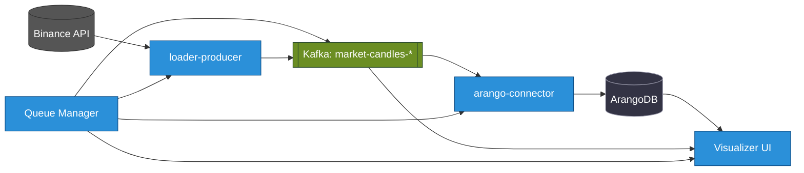

+++
date = '2025-06-13T20:14:52+02:00'
draft = true
title = 'Architektura i analiza danych kryptowalutowych w czasie rzeczywistym'
weight = 1
+++

### Status usługi

| Usługa | Wersja | Kompilacja | Test | Wdrożenie |
| :--- | :---: | :---: | :--: | :----: |
| **queue-manager** |  |  |  |  |
| **dummy-service** |  |  |  |  |
| **arango-connector** |  |  |  |  |
| **loader-api-candles** |  |  |  |  |
| **loader-api-trades** |  |  |  |  |

# StreamForge: Wysokowydajna, sterowana zdarzeniami platforma do analizy danych kryptowalutowych w czasie rzeczywistym

**StreamForge** to zaawansowana, sterowana zdarzeniami platforma zaprojektowana do wysokoprzepustowego pozyskiwania, przetwarzania i analizy danych rynkowych kryptowalut w czasie rzeczywistym. Zbudowana w oparciu o nowoczesne technologie Cloud-Native i wzorce architektoniczne, StreamForge dostarcza skalowalne, odporne i elastyczne rozwiązanie do sprostania wyjątkowym wyzwaniom krajobrazu aktywów cyfrowych.

## Przegląd architektury

## 1.1. Wyzwanie danych kryptowalutowych

W szybko zmieniającym się świecie aktywów cyfrowych dane kryptowalutowe są siłą napędową analityki i zautomatyzowanego podejmowania decyzji. Dane te charakteryzują się ekstremalną zmiennością, dostępnością 24/7 i ogromną objętością, obejmując wszystko, od transakcji o wysokiej częstotliwości po ciągłe aktualizacje księgi zamówień. Cechy te wymagają nowej generacji potoków danych — takich, które są nie tylko wysokowydajne, ale także wyjątkowo niezawodne.

Kluczowe przeszkody techniczne obejmują:
- **Heterogeniczne pozyskiwanie danych:** Integracja rozbieżnych strumieni danych z wielu źródeł, w tym interfejsów API REST dla danych historycznych i kanałów WebSocket dla zdarzeń rynkowych w czasie rzeczywistym.
- **Ekstremalna skalowalność:** Architektura systemu zdolnego do przetwarzania ogromnych, gwałtownych strumieni danych bez wprowadzania opóźnień.
- **Integralność danych i odporność na błędy:** Zapewnienie gwarantowanej dostawy danych i projektowanie w celu szybkiego, zautomatyzowanego odzyskiwania po awariach komponentów.
- **Złożona orkiestracja przepływu pracy:** Zarządzanie zaawansowanymi, wieloetapowymi przepływami pracy przetwarzania danych, takimi jak sekwencja „załadowanie -> utrwalenie -> budowa grafu -> trenowanie modelu”, w skoordynowany i niezawodny sposób.

## 1.2. Rozwiązanie StreamForge: oddzielona, sterowana zdarzeniami architektura

StreamForge jest zaprojektowany jako w pełni sterowana zdarzeniami platforma, zaprojektowana od podstaw z myślą o maksymalnej wydajności i odporności. Podstawową zasadą jest całkowite oddzielenie usług za pośrednictwem centralnego układu nerwowego: **Apache Kafka**. Zamiast bezpośrednich, kruchych wywołań między usługami, komponenty komunikują się asynchronicznie. Każdy mikroserwis jest samodzielną jednostką, która publikuje zdarzenia (swoją pracę).

Zastosowanie tego podejścia gwarantuje wysoką skalowalność, zdolność adaptacji do zmieniających się wymagań i zwiększoną odporność na błędy całego systemu.

## 1.3. Misja projektu

1.  **Stworzenie ujednoliconego źródła danych:** Konsolidacja procesów gromadzenia, weryfikacji i przechowywania danych rynkowych w celu zapewnienia szybkiego i wygodnego dostępu do informacji wysokiej jakości.
2.  **Stworzenie innowacyjnego środowiska dla nauki o danych:** Zapewnienie wyspecjalizowanej platformy do rozwoju, testowania i walidacji modeli analitycznych, w tym zaawansowanych architektur grafowych sieci neuronowych (GNN).
3.  **Zbudowanie niezawodnej podstawy dla handlu algorytmicznego:** Opracowanie wysokowydajnego i odpornego na błędy potoku danych, o kluczowym znaczeniu dla funkcjonowania zautomatyzowanych systemów transakcyjnych.
4.  **Kompleksowa automatyzacja procesów:** Minimalizacja interwencji manualnej na wszystkich etapach cyklu życia danych, od gromadzenia po przetwarzanie analityczne, w celu zwiększenia wydajności operacyjnej.

## 1.4. Praktyczne przypadki użycia

- **Scenariusz 1: Trenowanie modelu na danych historycznych.**
  - **Cel:** Wytrenowanie modelu GNN na retrospektywnych danych transakcyjnych i zagregowanych 5-minutowych świecach dla pary handlowej `BTCUSDT` w ciągu ostatniego miesiąca.
  - **Metoda:** Pełny cykl przetwarzania danych jest aktywowany za pośrednictwem `queue-manager`. Zadania są wykonywane przez zadania Kubernetes: `loader-producer` ładuje dane do Apache Kafka, `arango-connector` zapewnia ich trwałe przechowywanie w ArangoDB, `graph-builder` tworzy strukturę grafu, a `gnn-trainer` przeprowadza trenowanie modelu.

- **Scenariusz 2: Monitorowanie rynku w czasie rzeczywistym.**
  - **Cel:** Uzyskanie danych strumieniowych o transakcjach i stanie księgi zamówień w czasie rzeczywistym dla pary handlowej `ETHUSDT`.
  - **Metoda:** Moduł `loader-ws` nawiązuje połączenie z WebSocket i przesyła dane do Apache Kafka. Rozwijany moduł wizualizacji subskrybuje odpowiednie tematy, aby wyświetlać dane na interaktywnym pulpicie nawigacyjnym.

- **Scenariusz 3: Szybka analiza danych.**
  - **Cel:** Weryfikacja hipotezy dotyczącej korelacji między wolumenami obrotu a zmiennością rynku.
  - **Metoda:** Użycie `Jupyter Server` do nawiązania połączenia z ArangoDB i przeprowadzenia badań analitycznych na podstawie danych już zagregowanych i przetworzonych przez system StreamForge.

Te potężne funkcje sprawiają, że StreamForge jest niezbędnym narzędziem dla każdego, kto dąży do maksymalnej wydajności w pracy z danymi kryptowalutowymi.

## Obrazy kontenerów

Następujące obrazy Docker są publikowane w GitHub Container Registry (GHCR):

| Usługa | Status | Obraz | Polecenie pobierania |
|---|---|---|---|
| dummy-service |  | `ghcr.io/0leh-kondratov/dummy-service:latest` | `docker pull ghcr.io/0leh-kondratov/dummy-service:latest` |
| streamforge-base |   | `ghcr.io/0leh-kondratov/stream-forge-base:v0.1.3` | `docker pull ghcr.io/0leh-kondratov/stream-forge-base:v0.1.3` |

---