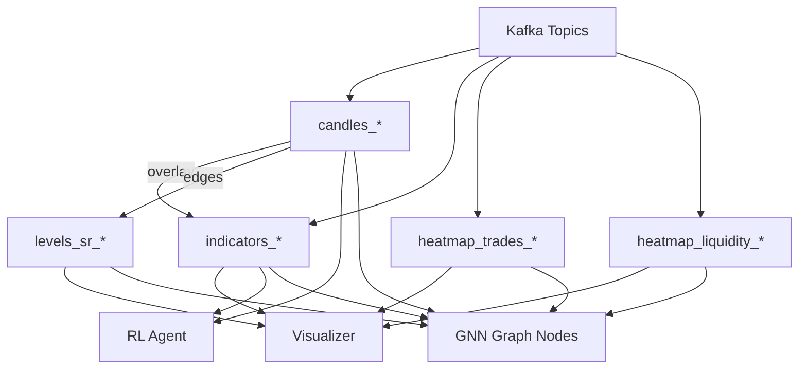
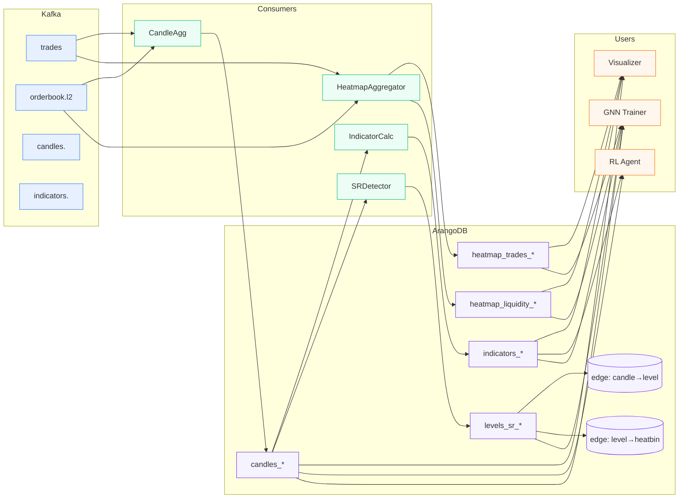

+++
title = "Модель данных StreamForge"
weight = 3
+++

## Модель данных StreamForge

1) Структура репозитория
```
your-repo/
├─ config.toml                    # или config.yaml
├─ assets/
│  └─ js/mermaid-init.js
├─ layouts/
│  └─ shortcodes/mermaid.html     # шорткод для Mermaid
├─ content/
│  ├─ ru/
│  │  └─ docs/
│  │     └─ data-model/
│  │        ├─ _index.md
│  │        ├─ collections.md
│  │        ├─ visualizer.md
│  │        └─ rl-gnn.md
│  ├─ en/…                        # (опц.) мультиязык
│  └─ pl/…
├─ static/
│  └─ img/
│     └─ streamforge/
│        └─ legend.png
├─ data/
│  └─ aql/
│     ├─ upserts.json             # примеры AQL в одном месте
│     └─ rollups.json
└─ .github/
   └─ workflows/
      └─ hugo.yml                 # CI для GitHub Pages

```



# 3) Контент-страницы (RU)
Этот раздел описывает конвейер **Kafka → ArangoDB → Visualizer/RL/GNN**, коллекции и индексы, а также примеры AQL `UPSERT` и rollup.



## "Коллекции и индексы"

### Свечи (`candles_{symbol}_{interval}`)
- Уникальный ключ: `symbol, interval, ts`
- Индексы:
  - *Persistent (unique)*: `["symbol","interval","ts"]`
  - *Skiplist*: `["ts"]`

```json
  "_key": "BTCUSDT-1m-1725231600",
  "symbol": "BTCUSDT",
  "interval": "1m",
  "ts": 1725231600000,
  "open": 59350.1, "high": 59420.0, "low": 59290.0, "close": 59380.4,
  "volume": 12.345, "quote_volume": 733456.2, "trades": 120,
  "created_at": "2025-09-02T12:00:00Z"
```

Индикаторы (indicators_{symbol}_{interval})
Уникальный ключ: symbol, interval, ts
Индексы:
Persistent (unique): ["symbol","interval","ts"]
Skiplist: ["ts"]

```json
{
  "_key": "BTCUSDT-1m-1725231600",
  "symbol": "BTCUSDT", "interval": "1m", "ts": 1725231600000,
  "ema_20": 59360.2, "ema_40": 59345.5, "rsi_14": 62.5, "atr_14": 15.3,
  "bb_ma20": 59350.7, "bb_upper": 59450.2, "bb_lower": 59250.1,
  "vwap": 59370.0, "created_at": "2025-09-02T12:00:00Z"
}
```

Уровни S/R (levels_sr_{symbol}_{interval})
Индексы:
Persistent: ["symbol","interval","detected_at"]
Skiplist: ["level_price"]

```json
{
  "_key": "BTCUSDT-1m-1725231600-1",
  "symbol": "BTCUSDT", "interval": "1m",
  "detected_at": 1725231600000,
  "level_price": 59350.0,
  "type": "support",
  "method": "swing_high",
  "strength": 0.85, "touches": 5,
  "valid_until": 1725318000000
}
```

Теплокарта — объёмы (heatmap_trades_{interval})
Уникальный ключ: symbol, interval, time_bucket, price_bin

```json
{
  "_key": "BTCUSDT-1m-1725231600000-59300.0",
  "symbol": "BTCUSDT", "interval": "1m",
  "time_bucket": 1725231600000,
  "price_bin": 59300.0, "bin_size_abs": 10.0,
  "base_volume": 12.345, "quote_volume": 733456.2, "trades": 120,
  "buy_volume": 7.12, "sell_volume": 5.22
}
```
Теплокарта — ликвидность (heatmap_liquidity_{interval})
Уникальный ключ: symbol, interval, time_bucket, price_bin

```json
{
  "_key": "BTCUSDT-1s-1725231600000-59300.0",
  "symbol": "BTCUSDT", "interval": "1s",
  "time_bucket": 1725231600000, "price_bin": 59300.0,
  "avg_size": 125.4, "max_size": 900.0,
  "time_weighted_notional": 3.7e7, "dwell_time_ms": 840, "updates": 42
}
```

Edge-коллекции
    candle_to_level: _from=candles_*/*, _to=levels_sr_*/*
    level_to_heatbin: _from=levels_sr_*/*, _to=heatmap_*/*

## "Срезы для визулизатора"

| Коллекция              | Назначение в UI                   |
|------------------------|-----------------------------------|
| `candles_*`            | Базовый свечной график            |
| `indicators_*`         | Оверлеи: Bollinger, RSI, EMA, ATR |
| `levels_sr_*`          | Линии/зоны уровней S/R            |
| `heatmap_trades_*`     | Теплокарта объёмов                |
| `heatmap_liquidity_*`  | Теплокарта ликвидности (стены)    |
| `*_rollup`             | Быстрый обзор (день/неделя)       |

### Быстрый AQL для теплокарты (по окну времени/цены)

```aql
FOR h IN heatmap_trades_1m
  FILTER h.symbol == @symbol
    AND h.time_bucket BETWEEN @t_from AND @t_to
    AND h.price_bin   BETWEEN @p_min AND @p_max
  RETURN KEEP(h, "time_bucket","price_bin","quote_volume","trades")
```

## "Срезы для RL и GNN"


### RL (минимальный набор)
- `candles_*` — OHLCV как базовые признаки
- `indicators_*` — RSI/EMA/ATR/VWAP (готовые признаки)

### Доп. контекст для RL (опционально)
- `heatmap_liquidity_*` → признаки стен/imbalance
- `levels_sr_*` → бинарные/скалярные «вблизи уровня»

### GNN — графовая модель
- Узлы: `candle (ts,symbol)`, `level`, `heatbin`
- Рёбра: `candle→level`, `level→heatbin`, (опц. `candle→candle` по времени)

```mermaid
graph TD
  C1[(candle@t)] --> Lx[(level)]
  C2[(candle@t+1)] --> Lx
  Lx --> HB1[(heatbin p1)]
  Lx --> HB2[(heatbin p2)]
```

#### AQL-шаблоны Рёбер:
```aql
INSERT { _from: @candle_id, _to: @level_id, weight: @touch_weight } IN candle_to_level
INSERT { _from: @level_id,  _to: @heatbin_id, metric: "volume", weight: @w } IN level_to_heatbin
```

# 4) Примеры AQL (UPSERT/rollup) в `data/aql/*.json`

## 4.1. `data/aql/upserts.json`
```json
{
  "candles_upsert": "UPSERT { symbol:@symbol, interval:@interval, ts:@ts } INSERT { _key: CONCAT_SEPARATOR('-',@symbol,@interval,TO_STRING(@ts)), symbol:@symbol, interval:@interval, ts:@ts, open:@open, high:@high, low:@low, close:@close, volume:@vol, quote_volume:@qvol, trades:@trades, created_at: DATE_ISO8601(DATE_NOW()) } UPDATE { open:@open, high:@high, low:@low, close:@close, volume:@vol, quote_volume:@qvol, trades:@trades } IN @@col",
  "indicators_upsert": "UPSERT { symbol:@symbol, interval:@interval, ts:@ts } INSERT { _key: CONCAT_SEPARATOR('-',@symbol,@interval,TO_STRING(@ts)), symbol:@symbol, interval:@interval, ts:@ts, ema_20:@ema20, ema_40:@ema40, rsi_14:@rsi14, atr_14:@atr14, bb_ma20:@bb_ma, bb_upper:@bb_up, bb_lower:@bb_lo, vwap:@vwap, created_at: DATE_ISO8601(DATE_NOW()) } UPDATE { ema_20:@ema20, ema_40:@ema40, rsi_14:@rsi14, atr_14:@atr14, bb_ma20:@bb_ma, bb_upper:@bb_up, bb_lower:@bb_lo, vwap:@vwap } IN @@col",
  "levels_upsert": "UPSERT { _key:@key } INSERT { _key:@key, symbol:@symbol, interval:@interval, detected_at:@det, level_price:@price, type:@type, method:@method, strength:@strength, touches:@touches, valid_until:@valid } UPDATE { strength:@strength, touches:@touches, valid_until:@valid } IN @@col"
}
```

4.2. data/aql/rollups.json
```json
{
  "heatmap_trades_rollup_1d": "FOR h IN @@src FILTER h.symbol==@symbol AND h.time_bucket>=@day_start AND h.time_bucket<@day_end COLLECT price_bin = FLOOR(h.price_bin / @bin_abs) * @bin_abs AGGREGATE base_volume = SUM(h.base_volume), quote_volume = SUM(h.quote_volume), trades = SUM(h.trades) LET _key = CONCAT_SEPARATOR('-',@symbol,@date,TO_STRING(price_bin)) UPSERT { _key } INSERT { _key, symbol:@symbol, date:@date, price_bin, bin_size_abs:@bin_abs, base_volume, quote_volume, trades } UPDATE { base_volume, quote_volume, trades } IN @@dst"
}
```

# 5) GitHub Actions для GitHub Pages
.github/workflows/hugo.yml
```yaml
name: hugo-gh-pages
on:
  push:
    branches: ["main"]
  workflow_dispatch:

permissions:
  contents: read
  pages: write
  id-token: write

jobs:
  build-deploy:
    runs-on: ubuntu-latest
    steps:
      - name: Checkout
        uses: actions/checkout@v4

      - name: Setup Hugo
        uses: peaceiris/actions-hugo@v2
        with:
          hugo-version: '0.128.0'
          extended: true

      - name: Build
        run: hugo --minify

      - name: Upload artifact
        uses: actions/upload-pages-artifact@v3
        with:
          path: ./public

      - name: Deploy to GitHub Pages
        uses: actions/deploy-pages@v4
```


