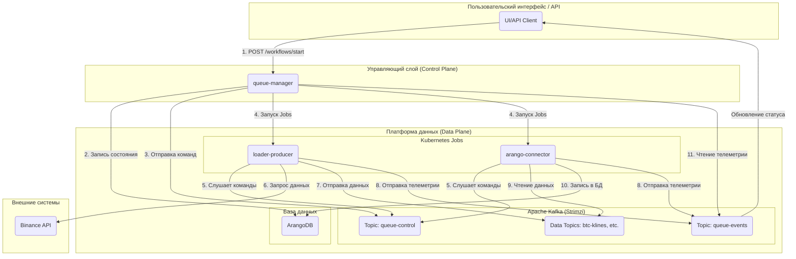

# Проект технического документа (Версия 2.0)

# Содержание

# Часть I: Введение и бизнес-контекст

# Глава 1: Общее описание проекта StreamForge


### **1.1. Проблема: Сложность и волатильность потоков крипто-данных**

Работа с данными криптовалютных рынков сопряжена с рядом фундаментальных вызовов. В отличие от традиционных финансовых рынков, крипто-данные характеризуются экстремальной волатильностью, круглосуточной торговлей (24/7) и огромным объемом. Потоки данных, такие как обновления книги ордеров (order book), тики сделок (trades) и свечи (klines), генерируются с высокой частотой и требуют обработки в режиме, близком к реальному времени.

Создание надежной системы для сбора, обработки и анализа таких данных требует решения следующих проблем:
*   **Управление множественными источниками:** Необходимо одновременно работать с различными типами данных, поступающими как через REST API (для исторических срезов), так и через WebSocket (для real-time потоков).
*   **Масштабируемость и производительность:** Система должна быть способна обрабатывать пиковые нагрузки во время высокой рыночной активности без потери данных.
*   **Надежность и отказоустойчивость:** Временный сбой одного из компонентов (например, загрузчика или коннектора к базе данных) не должен приводить к потере данных или остановке всей системы.
*   **Сложность оркестрации:** Запуск сложных, многоэтапных задач, таких как "загрузить данные -> сохранить в БД -> построить граф -> обучить модель", требует сложной логики управления зависимостями и отслеживания состояния.

### **1.2. Видение: Создание интеллектуальной, событийно-управляемой аналитической платформы**

Проект **StreamForge** — это ответ на перечисленные вызовы. Наше видение заключается в создании не просто набора инструментов для сбора данных, а целостной, интеллектуальной и **событийно-управляемой (event-driven)** платформы.

В основе архитектуры лежит принцип **декаплинга (decoupling)**: компоненты системы не взаимодействуют друг с другом напрямую через API-вызовы. Вместо этого они общаются асинхронно через брокер сообщений **Apache Kafka**. Такой подход позволяет каждому микросервису быть независимым, автономным и легко заменяемым. Центральный оркестратор (`queue-manager`) не отдает прямые приказы, а лишь декларирует намерение в общем информационном пространстве, на которое реагируют нужные исполнители.

Это позволяет построить "живую" систему, способную к саморегуляции, масштабированию и эволюции без остановки ее работы.

### **1.3. Ключевые цели и польза для бизнеса**

1.  **Создание надежного источника данных (Single Source of Truth):** Централизовать сбор, очистку и хранение рыночных данных, предоставляя единую, консистентную точку доступа для всех последующих приложений.
2.  **Платформа для количественных исследований:** Предоставить дата-сайентистам и аналитикам готовую среду для построения и тестирования сложных аналитических моделей, включая графовые нейронные сети (GNN).
3.  **Основа для алгоритмической торговли:** Сформировать высокопроизводительный и низколатентный конвейер данных, который может служить фундаментом для разработки и эксплуатации торговых ботов.
4.  **Снижение операционных издержек:** Автоматизировать процессы загрузки, обработки и анализа данных, минимизируя необходимость ручного вмешательства.

### **1.4. Основные сценарии использования**

*   **Сценарий 1: Историческая загрузка для обучения модели.**
    *   **Задача:** Аналитик хочет обучить GNN-модель на данных по сделкам и 5-минутным свечам для пары `BTCUSDT` за последний месяц.
    *   **Решение:** Пользователь через UI или API отправляет в `queue-manager` один запрос, описывающий весь workflow. Система автоматически запускает Kubernetes Jobs для `loader-producer` (загрузка данных в Kafka), `arango-connector` (сохранение в ArangoDB), `graph-builder` (построение графа) и `gnn-trainer` (обучение модели).

*   **Сценарий 2: Real-time мониторинг рынка.**
    *   **Задача:** Трейдер хочет в реальном времени отслеживать поток сделок и состояние книги ордеров для пары `ETHUSDT`.
    *   **Решение:** Запускается workflow с `loader-ws` (подписка на WebSocket), который поставляет данные в Kafka. Сервис `visualizer` подписывается на соответствующие топики и отображает данные на дашборде.

*   **Сценарий 3: Ad-hoc анализ данных.**
    *   **Задача:** Дата-сайентист хочет проверить гипотезу, связанную с корреляцией объемов торгов и волатильности.
    *   **Решение:** Используя `Jupyter Server`, подключенный к платформе, аналитик может напрямую выполнять запросы к данным, хранящимся в ArangoDB, которые были собраны и обработаны StreamForge.

Часть II: Архитектура приложения StreamForge

### **Глава 2: Высокоуровневая архитектура приложения**

#### **2.1. Ключевые принципы**

Архитектура StreamForge построена на трех фундаментальных принципах, обеспечивающих ее гибкость, надежность и готовность к будущим вызовам.

1.  **Декаплинг (Decoupling) через события:**
    Компоненты системы не связаны жесткими зависимостями. Вместо прямых API-вызовов, которые создают хрупкие связи, все взаимодействие происходит асинхронно через брокер сообщений Kafka. `queue-manager` не знает, где и как запущен `loader-producer`; он лишь публикует "приказ" в топик `queue-control`. Любой воркер, соответствующий критериям, может взять этот приказ в работу. Это позволяет независимо разрабатывать, обновлять и масштабировать каждый микросервис, не затрагивая остальные части системы.

2.  **Масштабируемость (Scalability):**
    Платформа спроектирована для горизонтального масштабирования. Воркеры (`loader-*`, `arango-connector` и др.) являются stateless-приложениями, запускаемыми как Kubernetes Jobs. При увеличении нагрузки (например, при необходимости одновременной загрузки данных по сотням торговых пар) `queue-manager` просто создаст большее количество Jobs. Использование партиций в Kafka позволяет распараллелить обработку данных, а интеграция с **KEDA** (Kubernetes Event-driven Autoscaling) в будущем позволит автоматически масштабировать количество консьюмеров в зависимости от длины очереди в топике.

3.  **Наблюдаемость (Observability):**
    Понимание состояния распределенной системы критически важно. В StreamForge наблюдаемость обеспечивается тремя столпами:
    *   **Метрики:** Каждый микросервис экспортирует метрики в формате Prometheus, которые собираются и визуализируются в Grafana. Это позволяет отслеживать технические параметры (CPU, память) и бизнес-метрики (количество обработанных записей, задержки).
    *   **Логи:** Все логи собираются централизованно с помощью `Fluent-bit` и отправляются в `Elasticsearch`, где их можно анализировать и искать через `Kibana`.
    *   **Телеметрия (Бизнес-трейсинг):** Топик `queue-events` выступает в роли системы распределенного трейсинга на уровне бизнес-логики. Он позволяет отследить жизненный цикл каждой задачи от момента ее создания до успешного завершения или ошибки, проходя через все задействованные микросервисы.

#### **2.2. Архитектурная схема и поток данных**

Ниже представлена схема, иллюстрирующая взаимодействие ключевых компонентов системы в рамках выполнения задачи по исторической загрузке данных.



**Описание потока данных (Workflow):**
1.  **Инициация:** Пользователь через UI или API отправляет запрос на запуск workflow в `queue-manager`.
2.  **Сохранение состояния:** `queue-manager` создает запись о новом workflow в своей базе данных (ArangoDB) со статусом `pending`.
3.  **Декларация намерения:** `queue-manager` формирует и отправляет команду `start` в топик `queue-control`.
4.  **Запуск исполнителей:** `queue-manager` через Kubernetes API создает `Job` для каждого необходимого микросервиса (`loader-producer`, `arango-connector`).
5.  **Получение команды:** Запущенные микросервисы подписываются на `queue-control` и получают команду `start`.
6.  **Сбор данных:** `loader-producer` обращается к API Binance для получения данных.
7.  **Публикация данных:** `loader-producer` отправляет полученные данные в соответствующий топик данных в Kafka (например, `btc-klines-1m`).
8.  **Отправка телеметрии:** Оба воркера (`loader` и `arango-connector`) периодически отправляют события о своем статусе (например, `loading`, `records_written: 1000`) в топик `queue-events`.
9.  **Потребление данных:** `arango-connector` читает данные из топика.
10. **Сохранение данных:** `arango-connector` записывает данные в целевую коллекцию в ArangoDB.
11. **Обратная связь:** `queue-manager` слушает топик `queue-events`, чтобы обновлять статус workflow в своей базе данных и транслировать его в UI через WebSocket.

Глава 3: Коммуникационная модель на базе Kafka

### **Глава 3: Коммуникационная модель на базе Kafka**

#### **3.1. Обоснование выбора событийно-ориентированного подхода**

Выбор Apache Kafka в качестве центральной нервной системы проекта не случаен. Событийно-ориентированная архитектура (Event-Driven Architecture, EDA) предоставляет ряд критически важных преимуществ по сравнению с традиционной моделью, основанной на прямых API-вызовах:

*   **Временной декаплинг (Temporal Decoupling):** Продюсер (например, `loader-producer`) и консьюмер (например, `arango-connector`) не обязаны быть онлайн одновременно. `loader` может отправить данные в Kafka и завершить свою работу. `arango-connector` может быть запущен позже и обработать эти данные, когда ему будет удобно.
*   **Отказоустойчивость:** Kafka выступает в роли персистентного буфера. Если сервис-консьюмер выходит из строя, сообщения не теряются, а остаются в топике до тех пор, пока консьюмер не будет перезапущен и не сможет продолжить обработку с того места, где остановился.
*   **Гибкость и расширяемость:** Добавление нового обработчика данных (например, сервиса для real-time алертинга) не требует изменения существующих компонентов. Достаточно создать новый микросервис, который будет подписываться на тот же топик с данными.

#### **3.2. Спецификация управляющих топиков**

Вся оркестрация и мониторинг в StreamForge построены на двух служебных топиках.

##### **Топик `queue-control`**

*   **Назначение:** Декларативная отправка команд от `queue-manager` к воркерам.
*   **Продюсеры:** `queue-manager`.
*   **Консьюмеры:** Все воркеры (`loader-*`, `arango-connector`, `graph-builder` и т.д.).
*   **Формат сообщения:**
    ```json
    {
      "command": "start" | "stop",
      "queue_id": "wf-btcusdt-api_candles_5m-20240801-a1b2c3",
      "target": "loader-producer",
      "symbol": "BTCUSDT",
      "type": "api_candles_5m",
      "time_range": "2024-08-01:2024-08-02",
      "kafka_topic": "wf-btcusdt-api_candles_5m-20240801-a1b2c3-data",
      "collection_name": "btcusdt_api_candles_5m_2024_08_01",
      "telemetry_id": "loader-producer__a1b2c3",
      "image": "registry.dmz.home/streamforge/loader-producer:v0.2.0",
      "timestamp": 1722500000.123
    }
    ```

##### **Топик `queue-events`**

*   **Назначение:** Централизованный сбор телеметрии от всех микросервисов. Является "пульсом" системы.
*   **Продюсеры:** Все воркеры.
*   **Консьюмеры:** `queue-manager` (для обновления статусов и трансляции в UI).
*   **Формат сообщения:**
    ```json
    {
      "queue_id": "wf-btcusdt-api_candles_5m-20240801-a1b2c3",
      "producer": "arango-connector__a1b2c3",
      "symbol": "BTCUSDT",
      "type": "api_candles_5m",
      "status": "loading" | "finished" | "error" | "started" | "interrupted",
      "message": "Сохранено 15000 записей",
      "records_written": 15000,
      "finished": false,
      "timestamp": 1722500125.456
    }
    ```

### **Глава 4: Детальное описание микросервисов**

Платформа StreamForge состоит из набора специализированных, независимых микросервисов, каждый из которых выполняет четко определенную функцию.

#### **4.1. `queue-manager`: Центральный оркестратор**

`queue-manager` является "мозгом" всей системы. Это единственный компонент, с которым напрямую взаимодействует пользователь или внешняя система. Он отвечает за оркестрацию рабочих процессов (workflow), управление их жизненным циклом, а также за взаимодействие с другими микросервисами через Kafka и Kubernetes.

*   **Роль и обязанности:**
    *   **Точка входа:** Предоставляет REST API (на базе FastAPI) для управления жизненным циклом задач (workflows): запуск, остановка, получение статуса.
    *   **Оркестрация:** Принимает высокоуровневые запросы, декомпозирует их на конкретные шаги и генерирует команды для каждого воркера.
    *   **Управление состоянием:** Хранит состояние всех запущенных и завершенных workflows в базе данных ArangoDB.
    *   **Интеграция с Kubernetes:** Взаимодействует с Kubernetes API для динамического создания `Job` для каждого воркера в workflow.
    *   **Обратная связь:** Подписывается на топик телеметрии `queue-events`, чтобы отслеживать прогресс выполнения задач в реальном времени и обновлять их статус в UI через WebSocket.

*   **API Эндпоинты:**
    *   `POST /queues/start`: Запускает новую очередь (workflow). Принимает детальную конфигурацию для каждого микросервиса, участвующего в workflow.
        ```json
        {
          "command": "start",
          "queue_id": "loader-btcusdt-api_candles_5m-2024_06_01-abc123",
          "symbol": "BTCUSDT",
          "type": "api_candles_5m",
          "time_range": "2024-06-01:2024-06-02",
          "timestamp": 1722346211.177,
          "targets": [
            {
              "target": "loader-producer",
              "image": "registry.dmz.home/kinga/stream-forge/loader-producer:v0.1.0",
              "telemetry_id": "loader-producer__abc123",
              "kafka_topic": "loader-btcusdt-api-candles-5m-2024-06-01-abc123",
              "time_range": "2024-06-01:2024-06-02",
              "interval": "5m"
            },
            {
              "target": "arango-connector",
              "image": "registry.dmz.home/kinga/stream-forge/arango-connector:v0.1.0",
              "telemetry_id": "arango-connector__abc123",
              "kafka_topic": "loader-btcusdt-api-candles-5m-2024-06-01-abc123",
              "collection_name": "btc_candles_5m_2024_06_01"
            }
          ]
        }
        ```
    *   `POST /queues/start-test-flow`: Запускает предопределенный тестовый data-flow на основе шаблонов из `test_flows.yaml`. Упрощает запуск сложных тестовых сценариев.
        ```json
        {
          "flow_name": "historical_candles_to_arango",
          "symbol": "ETHUSDT",
          "time_range": "2024-07-01:2024-07-02",
          "extra_params": {
            "loader_image_version": "v0.1.1"
          }
        }
        ```
    *   `GET /queues/list`: Возвращает список всех запущенных и завершенных очередей.
    *   `POST /queues/stop`: Останавливает указанную очередь, отправляя команду `stop` в Kafka.

*   **Технологии:** Python, FastAPI, Pydantic, `python-kubernetes`, `aiokafka`, ArangoDB.


#### **4.2. Слой сбора данных: Семейство `loader-*`**

Эти микросервисы отвечают за получение данных из внешних источников (Binance) и их публикацию в Kafka. Они спроектированы как stateless-воркеры, запускаемые в виде Kubernetes Jobs.

*   **`loader-producer` (базовый)**
    *   **Роль:** Универсальный загрузчик данных из внешних источников (например, REST API Binance) и публикация их в Kafka.
    *   **Логика:** Работает асинхронно с использованием `asyncio` и `uvloop` для высокой производительности. Получает конфигурацию через переменные окружения. Слушает топик `queue-control` для команд управления (например, `stop`) и отправляет детальную телеметрию о своем статусе (`started`, `interrupted`, `finished`, `error`) в топик `queue-events`.
*   **`loader-api-*` (например, `loader-api-candles`, `loader-api-trades`)**
    *   **Роль:** Специализированные загрузчики исторических данных через REST API.
    *   **Логика:** Наследуют функциональность от базового `loader-producer`, фокусируясь на получении данных для конкретных типов (свечи, сделки) и временных диапазонов.
*   **`loader-ws-*` (например, `loader-ws-orderbook`)**
    *   **Роль:** Специализированные загрузчики данных в реальном времени через WebSocket.
    *   **Логика:** Устанавливают постоянное WebSocket-соединение с источником, получают поток событий и транслируют их в Kafka.
*   **Общие обязанности:**
    *   Получают всю конфигурацию (символ, тип данных, Kafka-топик и т.д.) через переменные окружения.
    *   Слушают топик `queue-control` для корректного завершения работы по команде `stop`.
    *   Отправляют детальную телеметрию о своей работе в `queue-events`.
*   **Технологии:** Python, `aiohttp` (для REST), `websockets` (для WebSocket), `aiokafka`, `uvloop`, `orjson`.

#### **4.3. Слой хранения данных: Семейство `arango-connector`**

Эти микросервисы выступают в роли моста между Kafka и базой данных ArangoDB.

*   **Роль и обязанности:**
    *   **Потребление данных:** Подписываются на определенный топик с данными в Kafka.
    *   **Пакетная запись:** Накапливают сообщения в буфере и записывают их в ArangoDB пачками (батчами) для повышения производительности.
    *   **Идемпотентность:** Используют операцию `UPSERT` и уникальный ключ `_key` для каждого документа, что гарантирует отсутствие дубликатов при повторной обработке сообщений.
    *   **Обработка ошибок:** Корректно обрабатывают невалидные сообщения (например, "битый" JSON), логируют их и продолжают работу, не останавливая весь конвейер.
*   **Технологии:** Python, `aioarango`, `aiokafka`.

#### **4.4. Аналитический слой: `graph-builder` и `gnn-trainer`**

Это наукоемкая часть платформы, отвечающая за продвинутый анализ данных и машинное обучение.

*   **`graph-builder`**
    *   **Роль:** Преобразование табличных данных (свечи, сделки) в графовую структуру.
    *   **Логика:** Читает данные из нескольких коллекций ArangoDB, рассчитывает корреляции или другие метрики взаимосвязи между активами и строит граф, где узлы — это торговые пары, а ребра — их взаимосвязи. Сохраняет результат в отдельную графовую коллекцию в ArangoDB.
*   **`gnn-trainer`**
    *   **Роль:** Обучение моделей графовых нейронных сетей (GNN).
    *   **Логика:** Загружает граф, построенный `graph-builder`. Определяет и обучает GNN-модель (например, на базе `GATv2Conv`) для решения задачи классификации или регрессии (например, прогнозирование движения цены). Сохраняет обученную модель и артефакты (например, веса, метрики обучения) в объектное хранилище `MinIO`.
*   **Технологии:** Python, `aioarango`, `PyTorch`, `PyTorch Geometric (PyG)`, `minio-py`.

#### **4.5. `dummy-service`: Микросервис для тестирования и симуляции**

`dummy-service` — это тестовый микросервис StreamForge, предназначенный для симуляции поведения других сервисов, тестирования связности Kafka и отладки. Он может получать команды из `queue-control`, отправлять события в `queue-events`, имитировать загрузку и ошибки, а также публиковать Prometheus-метрики.

*   **Роль и обязанности:**
    *   **Симуляция:** Имитирует работу других микросервисов (например, `loader-producer`) для тестирования сквозных сценариев без реальных данных.
    *   **Тестирование Kafka:** Используется для проверки связности с Kafka через команды `ping/pong`.
    *   **Отладка:** Позволяет имитировать различные состояния (загрузка, ошибка) для отладки системы мониторинга и оркестрации.
    *   **Метрики:** Экспортирует Prometheus-метрики для наблюдения за его поведением.
*   **Технологии:** Python, FastAPI, `aiokafka`, `loguru`, `prometheus_client`.
*   **Подробнее:** См. `services/dummy-service/README.md`.

Часть III: Инфраструктурная платформа и технологический стек

### **Глава 5: Основы платформы: Kubernetes и виртуализация**

Приложение StreamForge разворачивается на базе мощной и гибкой инфраструктурной платформы, построенной на основе Kubernetes и современных cloud-native инструментов.

#### **5.1. Физический уровень: Гипервизор Proxmox VE**

В качестве основы для виртуализации используется `Proxmox VE`. Это позволяет эффективно управлять физическими ресурсами, создавать виртуальные машины для узлов Kubernetes и обеспечивать изоляцию и гибкость в распределении вычислительных мощностей.

#### **5.2. Развертывание кластера: Kubespray**

Кластер Kubernetes разворачивается с помощью `Kubespray`. Этот инструмент обеспечивает автоматизированное и воспроизводимое создание production-ready кластеров, что значительно упрощает первоначальную настройку и последующие обновления.

#### **5.3. Сетевая инфраструктура**

*   **`kube-vip` для High Availability Control Plane:** Для обеспечения высокой доступности управляющих узлов (control plane) используется `kube-vip`. Он предоставляет виртуальный IP-адрес для Kubernetes API-сервера, что позволяет избежать единой точки отказа.
*   **`MetalLB` для Service Type `LoadBalancer`:** В "bare-metal" окружении `MetalLB` позволяет использовать стандартный тип сервиса `LoadBalancer`, предоставляя внешние IP-адреса для доступа к сервисам извне кластера.

#### **5.4. Ingress и Gateway API**

Для управления внешним трафиком и его маршрутизации к внутренним сервисам используются два ведущих Ingress-контроллера: `Traefik` и `ingress-nginx`. `Traefik` является предпочтительным решением, в том числе благодаря его поддержке нового стандарта **Gateway API**, который предлагает более гибкую и ролевую модель управления трафиком. `ingress-nginx` (версия `4.12.1`, приложение `1.12.1`) также развернут со стандартными настройками и служит в качестве альтернативного или дополнительного Ingress-контроллера.

**Конфигурация Traefik (версия `36.1.0`, приложение `v3.4.1`):**

*   **Точки входа (EntryPoints):**
    *   `web`: HTTP на порту `80`, автоматически перенаправляется на `websecure` (HTTPS).
    *   `websecure`: HTTPS на порту `443` с включенным TLS.
    *   `ssh`: TCP на порту `2222`.
    *   `kafka`: TCP на порту `9094`.
*   **Панель мониторинга (Dashboard):** Включена и доступна через Ingress по адресу `traefik.dmz.home/dashboard`. Для нее автоматически выпускается TLS-сертификат (`traefik-dashboard-tls`) с помощью `cert-manager`.
*   **Управление сертификатами:** Используется `certificatesResolvers` с `default` ACME-челленджем для автоматического получения TLS-сертификатов. Хранилище для ACME-данных (`acme.json`) находится в персистентном томе.
*   **Персистентность:** Включена персистентность с `PersistentVolumeClaim` размером `1Gi` на базе `nfs-client` для хранения данных Traefik (например, ACME-сертификатов).
*   **Тип сервиса:** `LoadBalancer` с фиксированным IP-адресом `192.168.1.153` для внешнего доступа.
*   **Провайдеры:** Включены `kubernetesCRD` и `kubernetesIngress` для обнаружения и маршрутизации трафика к сервисам, определенным через Ingress-ресурсы и кастомные ресурсы Traefik.

#### **5.5. Управление DNS и TLS**

*   **`Technitium DNS Server`:** Используется как локальный DNS-сервер для разрешения имен в домене `dmz.home`, что упрощает доступ к сервисам по человекочитаемым именам.
*   **`cert-manager`:** Автоматизирует процесс управления TLS-сертификатами. В связке с локальным `ClusterIssuer` он обеспечивает автоматическую выдачу и ротацию сертификатов для всех Ingress-ресурсов, гарантируя безопасное `HTTPS`-соединение.

Глава 6: Система хранения данных (Storage)

### **Глава 6: Система хранения данных (Storage)**

Надежное и производительное хранилище является критически важным компонентом платформы StreamForge. Для различных типов данных и сценариев использования применяются специализированные решения.

#### **6.1. Обзор Storage-решений**

*   **`Linstor Piraeus` (RWO - ReadWriteOnce):** Это решение используется для предоставления высокопроизводительных блочных хранилищ. Оно идеально подходит для stateful-приложений, требующих низкой задержки и высокой пропускной способности, таких как базы данных (`ArangoDB`, `PostgreSQL`).
*   **`GlusterFS` и `NFS Subdir External Provisioner` (RWX - ReadWriteMany):** Эти системы предоставляют файловые хранилища с совместным доступом. Они используются для сценариев, где несколько подов должны одновременно читать и записывать данные в один и тот же том, например, для хранения общих конфигураций или лог-файлов.

    **`NFS Subdir External Provisioner` (версия `4.0.18`, приложение `4.0.2`):**
    *   **Сервер NFS:** `192.168.1.6`
    *   **Путь NFS:** `/data0/k2`
    *   **Назначение:** Используется для динамического выделения персистентных томов (PV) на основе существующего NFS-сервера, обеспечивая доступ `ReadWriteMany` (RWX) для нескольких подов. Это критически важно для общих файловых систем, таких как домашние директории JupyterHub или общие проектные данные.

#### **6.2. Объектное хранилище Minio**

`Minio` предоставляет S3-совместимое объектное хранилище внутри кластера. В StreamForge оно выполняет две ключевые функции:
1.  **Хранение артефактов машинного обучения:** `gnn-trainer` сохраняет в Minio обученные модели, их веса, чекпоинты и метрики обучения. Это обеспечивает версионирование и долгосрочное хранение результатов экспериментов.
2.  **Хранение бэкапов:** Используется для хранения резервных копий баз данных и других критически важных компонентов системы.

Глава 7: Платформа данных (Data Platform)

### **Глава 7: Платформа данных (Data Platform)**

Платформа данных является ядром StreamForge, обеспечивая сбор, передачу, хранение и обработку информации.

#### **7.1. `Strimzi Kafka Operator` как ядро системы обмена сообщениями**

`Strimzi` используется для декларативного управления кластерами Apache Kafka в Kubernetes. Он автоматизирует сложные задачи, такие как развертывание, конфигурация, управление топиками и пользователями, а также обеспечивает высокую доступность и отказоустойчивость брокера сообщений.

#### **7.2. Мультимодельная база данных `ArangoDB`**

`ArangoDB` выбрана в качестве основной базы данных благодаря своей мультимодельной природе. Она позволяет хранить данные как в виде документов (JSON), так и в виде графов, что идеально подходит для задач StreamForge:
*   **Документная модель:** Используется для хранения "плоских" данных, таких как исторические свечи, сделки и состояние очередей `queue-manager`.
*   **Графовая модель:** Является ключевой для аналитического слоя. `graph-builder` создает графы рыночных взаимосвязей, которые затем используются `gnn-trainer` для обучения моделей.

#### **7.3. Реляционная база данных `PostgreSQL` (Zalando Operator)**

Для хранения структурированных служебных данных, требующих строгой консистентности и транзакционности (например, конфигурации пользователей, метаданные), используется `PostgreSQL`. Управление кластером PostgreSQL автоматизировано с помощью оператора от Zalando, который обеспечивает высокую доступность и простоту управления.

#### **7.4. Автомасштабирование на основе событий с `KEDA`**

`KEDA` (Kubernetes Event-driven Autoscaling) позволяет автоматически масштабировать количество подов (воркеров) на основе внешних событий. В контексте StreamForge, KEDA будет использоваться для мониторинга длины очередей (lag) в топиках Kafka. Если количество необработанных сообщений в топике превышает заданный порог, KEDA автоматически увеличит количество подов-консьюмеров (например, `arango-connector`), а при уменьшении нагрузки — сократит их, оптимизируя использование ресурсов.

Глава 8: Наблюдаемость (Observability)

### **Глава 8: Наблюдаемость (Observability)**

Полноценная система наблюдаемости является краеугольным камнем для эксплуатации и отладки распределенной системы, такой как StreamForge.

#### **8.1. Стек метрик: `Prometheus`, `cAdvisor`, `NodeExporter`**

`Prometheus` используется для сбора и хранения временных рядов (метрик). `NodeExporter` собирает метрики с хостовых машин (CPU, RAM, disk), а `cAdvisor` — с контейнеров. Каждый микросервис StreamForge также предоставляет собственные метрики (например, `records_written_total`, `queue_requests_total`), которые автоматически обнаруживаются и собираются Prometheus.

**Ключевые особенности конфигурации:**

*   **Версия:** `kube-prometheus-stack-71.1.0` (приложение `v0.82.0`).
*   **Prometheus:**
    *   **Хранилище:** Использует `PersistentVolumeClaim` размером `20Gi` на базе `nfs-client` для хранения данных временных рядов.
    *   **Доступ:** Доступен через Ingress по адресу `prometheus.dmz.home` с использованием `nginx` Ingress-контроллера и TLS-сертификата (`prometheus-tls`).
*   **Alertmanager:**
    *   **Хранилище:** Использует `PersistentVolumeClaim` размером `500Mi` на базе `nfs-client` для хранения данных.
*   **Grafana:**
    *   **Хранилище:** Включена персистентность с `PersistentVolumeClaim` размером `1Gi` на базе `nfs-client`.
    *   **Доступ:** Доступен через Ingress по адресу `grafana.dmz.home` с использованием `nginx` Ingress-контроллера и TLS-сертификата (`grafana-tls`).
*   **Общие настройки:** Для всех Ingress-ресурсов используется `cert-manager` с `homelab-ca-issuer` для автоматического выпуска TLS-сертификатов.

#### **8.2. Стек логирования: `Fluent-bit`, `Elasticsearch`, `Kibana`**

Система логирования в StreamForge — это комплексное решение, обеспечивающее не только сбор и хранение, но и удобство отладки и анализа логов. Платформа использует гибридный подход, собирая как структурированные логи приложений, так и системные логи с узлов кластера.

**Ключевые компоненты и версии:**
*   **Elasticsearch:** `v8.12.0`
*   **Kibana:** `v8.12.0`
*   **Fluent-bit:** `v4.0.0-amd64`

**Архитектура сбора логов:**

Платформа разделяет сбор логов на два потока:

**1. Логи приложений (прямая пересылка):**

Этот механизм предназначен для микросервисов StreamForge и обеспечивает максимальную гибкость и обогащение данных.

*   **Метод:** Приложения, используя стандартные библиотеки логирования (например, `fluent-logger` для Python), отправляют свои логи по сети напрямую на централизованный сервис-агрегатор `fluent-bit` через протокол `forward` на порт `24224`.
*   **Динамическая генерация индексов:** Это ключевая особенность конфигурации. С помощью специального **Lua-скрипта** `fluent-bit` анализирует **тег** каждого входящего лога (например, `internal.my-app`). На основе этого тега и временной метки он динамически формирует имя индекса в Elasticsearch в формате `prefix-app-YYYY.MM.DD` (например, `internal-my-app-2025.08.06`). Такой подход критически важен для эффективного управления данными: он упрощает поиск, оптимизирует производительность и позволяет легко настраивать политики хранения.

**2. Системные и инфраструктурные логи (сбор из файлов):**

В дополнение к логам приложений, `fluent-bit` (развернутый как `DaemonSet`) также собирает стандартные логи с каждого узла кластера.
*   **Источники:** Конфигурация включает сбор логов из:
    *   `/var/log/syslog` (системные сообщения)
    *   `/var/log/nginx/access.log` (логи доступа Nginx)
    *   `/var/log/auth.log` (логи аутентификации)
*   **HTTP-вход:** Также открыт HTTP-вход на порту `8888` для приема логов от внешних систем.

**Конфигурация Elasticsearch и хранение данных:**

*   **Развертывание:** Elasticsearch работает как `StatefulSet` с одной репликой (`single-node`), что не обеспечивает высокой доступности, но подходит для текущих задач.
*   **Ресурсы:** Поду выделено 2-4Gi памяти и 1-2 ядра CPU.
*   **Хранилище:** Для данных используется `PersistentVolumeClaim` размером `10Gi` на базе `nfs-client`.
*   **Политика хранения (ILM):** Настроена политика жизненного цикла индексов (`ilmPolicy`) под названием `log-retention-30d`:
    *   **Rollover:** Новый индекс создается ежедневно (`rolloverAfter: 1d`) или когда размер текущего достигает `2gb`.
    *   **Удаление:** Данные автоматически удаляются через 30 дней (`deleteAfter: 30d`).
*   **Доступ:** Доступ к Kibana для анализа логов осуществляется по адресу `kibana.dmz.home` и защищен TLS-сертификатом.

**Примеры реализации (логи приложений):**

**1. Отправка логов из приложения (Python):**
Приложение должно использовать `fluent-logger` для отправки структурированных логов с правильным тегом.

```python
# Пример из test-logger-script.yaml
from fluent import sender
import time
import random
import json

APP_NAME = "my-pod-app"

# Настраиваем логгер для отправки на сервис fluent-bit
logger = sender.FluentSender(
    tag='internal.' + APP_NAME, # Важно: тег определяет будущий индекс!
    host='fluent-bit-service.logging.svc.cluster.local',
    port=24224
)

# Генерируем и отправляем структурированный лог
log_record = {
    'message': 'User logged in successfully',
    'level': 'INFO',
    'user_id': 12345
}
logger.emit('log', log_record)
```

**2. Обработка и создание индекса (Lua в Fluent-bit):**
Этот Lua-скрипт, вызываемый для каждой записи, извлекает части из тега и создает поле `log_index`, которое Elasticsearch использует для именования индекса.

```lua
# Пример из fluent-bit-config.yaml (set_index.lua)
function cb_set_index(tag, timestamp, record)
    local t = os.time()
    if timestamp and type(timestamp) == "table" and timestamp[1] > 0 then
        t = timestamp[1]
    end

    local prefix = "unknown"
    local app = "unknown"

    -- Разбираем тег, например, "internal.my-pod-app"
    local parts = {}
    for part in string.gmatch(tag, "([^.]+)") do
        table.insert(parts, part)
    end
    if #parts >= 2 then
        prefix = parts[1]  -- "internal"
        app = parts[2]     -- "my-pod-app"
    end

    -- Создаем имя индекса на основе даты
    local date = os.date("%Y.%m.%d", t)
    -- Добавляем новое поле в запись лога
    record["log_index"] = prefix .. "-" .. app .. "-" .. date -- получится "internal-my-pod-app-2025.08.06"
    return 1, timestamp, record
end
```

**Инструменты для отладки и тестирования:**

Для обеспечения надежности и удобства разработки в систему встроены специальные инструменты:

*   **`test-logger-script`:** Это тестовый Python-скрипт, который использует `fluent-logger` для генерации и отправки логов с заданным тегом напрямую в `fluent-bit`. Он позволяет разработчикам легко проверить весь конвейер логирования от отправки до появления записи в Kibana.
*   **`fluentbit-tailon`:** Это специальный отладочный `Deployment`, который запускает в одном поде два контейнера: `fluent-bit` и `tailon` (легковесный веб-интерфейс для просмотра логов). Этот `fluent-bit` принимает логи по сети и одновременно пишет их в локальный файл, который `tailon` тут же отображает. Это дает возможность в реальном времени видеть "сырой" поток логов, поступающий в систему, что бесценно для быстрой отладки без необходимости ждать индексации в Elasticsearch.

#### **8.3. Визуализация и алертинг: `Grafana`, `Alertmanager`**

`Grafana` служит единой точкой для визуализации как метрик из Prometheus, так и логов из Elasticsearch. Она используется для создания дашбордов, отображающих состояние системы в реальном времени. `Alertmanager` интегрирован с Prometheus и отвечает за дедупликацию, группировку и маршрутизацию алертов, отправляя уведомления в Telegram при возникновении критических ситуаций.

Глава 9: CI/CD и GitOps

### **Глава 9: CI/CD и GitOps**

Автоматизация сборки, тестирования и развертывания является основой для быстрой и надежной доставки изменений.

#### **9.1. `GitLab Runner` как исполнитель пайплайнов**

`GitLab Runner` является ключевым компонентом CI/CD, отвечающим за выполнение задач (jobs), определенных в `.gitlab-ci.yml`. В проекте используется `gitlab-runner` версии `bleeding` с исполнителем (executor) типа `kubernetes`, что обеспечивает глубокую интеграцию с кластером. Для сборки Docker-образов без использования Docker-in-Docker применяется `Kaniko`.

##### **9.1.1. Конфигурация и особенности исполнителя (Runner)**

**Общие настройки Runner:**

*   **Исполнитель (Executor):** `kubernetes`. Для каждой CI/CD задачи Runner создает отдельный Pod в неймспейсе `gitlab`, что гарантирует изоляцию сборок и тестов.
*   **Привязка к узлу:** Runner настроен на запуск подов исключительно на узле `k2w-9` с помощью `nodeSelector`.
*   **Права доступа:** Runner использует предварительно созданный `ServiceAccount` с именем `full-access-sa` и работает в привилегированном режиме (`privileged = true`). Это предоставляет подам с задачами широкие права в кластере, необходимые для сборки образов и развертывания приложений.
*   **Образ по умолчанию:** Для выполнения задач по умолчанию используется образ `ubuntu:22.04`.
*   **Ресурсы:** Для каждого пода с задачей установлены следующие лимиты и запросы:
    *   **Запрос:** 100m CPU, 128Mi RAM.
    *   **Лимит:** 500m CPU, 512Mi RAM.
*   **Кэширование:** Для ускорения CI/CD пайплайнов используется распределенное кэширование на базе S3.
    *   **Сервер:** `minio.dmz.home` (внутренний Minio).
    *   **Бакет:** `runner-cache`.
    *   **Безопасность:** Соединение с Minio осуществляется по HTTP (`Insecure = true`).
*   **Интеграция с Docker Registry:** Секрет `regcred` монтируется в поды как `/kaniko/.docker/config.json`, обеспечивая бесшовную аутентификацию для push- и pull-операций с приватными Docker-репозиториями.
*   **TLS:** Секрет `home-certificates` монтируется в `/kaniko/ssl/certs`, что позволяет `kaniko` и другим инструментам доверять внутренним TLS-сертификатам.

**Специфическая конфигурация `stf-runner` (k2m-runner):**

*   **Имя:** `k2m-runner` (отображается как `stf-runner` в `helm list`).
*   **Версия:** `0.79.0` (приложение `18.2.0`).
*   **URL GitLab:** `https://gitlab.dmz.home/`
*   **Пространство имен Kubernetes:** `gitlab`
*   **Таймаут опроса:** 300 секунд.
*   **Монтирование томов:**
    *   `docker-config` (из секрета `regcred`) монтируется в `/kaniko/.docker` для аутентификации Docker.
    *   `home-certificates` (из секрета `home-certificates`) монтируется в `/kaniko/ssl/certs` для доверия к внутренним TLS-сертификатам.
    *   `runner-home` (PVC `gitlab-runner-home`) монтируется в `/home/gitlab-runner` для персистентного хранения данных Runner.

##### **9.1.2. Структура CI/CD пайплайна**

CI/CD пайплайн проекта StreamForge организован в несколько последовательных стадий (`stages`), каждая из которых выполняет определенный набор задач (`jobs`).

**Стадии пайплайна:**
*   **`setup`**: На этой стадии выполняются подготовительные работы, такие как применение Kubernetes RBAC манифестов (Service Accounts, Roles, RoleBindings), чтобы обеспечить необходимые разрешения для последующих операций развертывания.
*   **`build`**: На этой стадии происходит сборка Docker-образов для всех микросервисов и базовых образов. Для сборки образов используется `Kaniko`, что позволяет выполнять сборку внутри кластера Kubernetes без необходимости запуска Docker-демона.
*   **`test`**: Эта стадия предназначена для запуска автоматизированных тестов (юнит-тестов, интеграционных тестов) для проверки функциональности и стабильности кода.
*   **`deploy`**: На этой стадии происходит развертывание собранных Docker-образов в Kubernetes кластер. Для взаимодействия с кластером используется `kubectl`.

**Как запускаются job'ы:**
Каждый job в пайплайне имеет определенные правила (`rules`), которые определяют, когда он должен быть запущен. Job'ы могут запускаться автоматически при изменениях в определенных файлах (например, при изменении кода сервиса или его `Dockerfile`), а также могут быть настроены на ручной запуск (`when: manual`) через интерфейс GitLab CI. Это обеспечивает гибкость и контроль над процессом развертывания.

##### **9.1.3. Детализация конфигурации пайплайнов**

Конфигурация CI/CD пайплайнов в StreamForge построена на принципах модульности и переиспользования кода с использованием возможностей GitLab CI `include` и `extends`.

**Основной файл `.gitlab-ci.yml`:**

Этот файл является точкой входа для всего пайплайна. Он определяет общие стадии (`stages`) и включает (`include`) конфигурации для отдельных сервисов и компонентов платформы. Это позволяет держать основной файл чистым и легко управляемым.

Пример `/.gitlab-ci.yml`:
```yaml
stages:
  - setup
  - build
  - test
  - deploy

include:
  - '/services/queue-manager/.gitlab-ci.yml'
  - '/services/loader-api-trades/.gitlab-ci.yml'
  - '/services/loader-api-candles/.gitlab-ci.yml'
  - '/services/arango-connector/.gitlab-ci.yml'
  - '/services/dummy-service/.gitlab-ci.yml'
  - 'platform/.gitlab-ci.yml' # Включаем конфигурацию для платформы (базовый образ, RBAC)
```

**Шаблоны CI/CD (`.gitlab/ci-templates/`):**

Для обеспечения единообразия и переиспользования логики сборки и тестирования, используются общие шаблоны. Например, `Python-Service.gitlab-ci.yml` содержит общую конфигурацию для сборки Docker-образов Python-сервисов.

Пример `/.gitlab/ci-templates/Python-Service.gitlab-ci.yml`:
```yaml
.build_python_service:
  stage: build
  image: gcr.io/kaniko-project/executor:debug
  script:
    - SERVICE_VERSION=$(cat $CI_PROJECT_DIR/$SERVICE_PATH/VERSION)
    - /kaniko/executor
      --context $CI_PROJECT_DIR/$SERVICE_PATH
      --dockerfile Dockerfile
      --destination $CI_REGISTRY_IMAGE/$SERVICE_NAME:$SERVICE_VERSION
  rules:
    - if: '$CI_PIPELINE_SOURCE == "merge_request_event"'
      changes:
        - $SERVICE_PATH/**/*
        - libs/**/*
    - if: '$CI_COMMIT_BRANCH == "main"'
      changes:
        - $SERVICE_PATH/**/*
        - libs/**/*
    - when: manual
      allow_failure: false
```

**Конфигурация для отдельных сервисов (`services/<service-name>/.gitlab-ci.yml`):**

Каждый микросервис имеет свой собственный `.gitlab-ci.yml` файл, который включает общий шаблон и расширяет его, предоставляя специфичные для сервиса переменные.

Пример `services/dummy-service/.gitlab-ci.yml`:
```yaml
include:
  - project: 'kinga/stream-forge'
    ref: main
    file: '/.gitlab/ci-templates/Python-Service.gitlab-ci.yml'

build-dummy-service:
  extends: .build_python_service
  variables:
    SERVICE_NAME: dummy-service
    SERVICE_PATH: services/dummy-service

deploy-dummy-service:
  stage: deploy
  image: bitnami/kubectl:latest
  script:
    - kubectl apply -f $CI_PROJECT_DIR/services/dummy-service/k8s/dummy-service-deployment.yaml
  rules:
    - if: '$CI_COMMIT_BRANCH == "main"'
      when: on_success
```

**Конфигурация для компонентов платформы (`platform/.gitlab-ci.yml`):**

Аналогично сервисам, компоненты платформы (например, сборка базового образа, применение RBAC) имеют свои собственные конфигурационные файлы.

Пример `platform/.gitlab-ci.yml`:
```yaml
include:
  - project: 'kinga/stream-forge'
    ref: main
    file: '/.gitlab/ci-templates/Python-Service.gitlab-ci.yml' # Используем тот же шаблон для сборки базового образа

build-base-image:
  extends: .build_python_service
  variables:
    SERVICE_NAME: base
    SERVICE_PATH: platform # Указываем путь к Dockerfile и VERSION для базового образа

apply-rbac:
  stage: setup
  image: bitnami/kubectl:latest
  script:
    - kubectl apply -f $CI_PROJECT_DIR/input/cred-kafka-yaml/full-access-sa.yaml
    - kubectl apply -f $CI_PROJECT_DIR/input/cred-kafka-yaml/full-access-sa-binding.yaml
  rules:
    - if: '$CI_COMMIT_BRANCH == "main"'
      changes:
        - input/cred-kafka-yaml/full-access-sa.yaml
        - input/cred-kafka-yaml/full-access-sa-binding.yaml
    - if: '$CI_PIPELINE_SOURCE == "merge_request_event"'
      changes:
        - input/cred-kafka-yaml/full-access-sa.yaml
        - input/cred-kafka-yaml/full-access-sa-binding.yaml
    - when: manual
      allow_failure: false
```

Такая структура обеспечивает гибкость, переиспользование и легкую масштабируемость CI/CD пайплайнов в проекте StreamForge.


#### **9.2. `ArgoCD` для декларативного управления состоянием кластера**

`ArgoCD` реализует подход GitOps, непрерывно синхронизируя состояние кластера с декларативным описанием, хранящимся в Git-репозитории. Это гарантирует, что кластер всегда находится в ожидаемом состоянии, и упрощает откат к предыдущим версиям.

**Ключевые особенности конфигурации:**

*   **Репозиторий GitOps:** Платформа предварительно сконфигурирована для работы с Git-репозиторием `iac_kubeadm` (`https://gitlab.dmz.home/infra-a-cod/iac_kubeadm.git`), который служит единым источником правды для состояния кластера.
*   **Доступ к серверу:** В текущей конфигурации (`server.insecure: true`) ArgoCD API-сервер доступен без шифрования TLS. Доступ к веб-интерфейсу осуществляется через домен `argocd.dmz.home`, однако Ingress-ресурс для него управляется отдельно (`server.ingress.enabled: false`).
*   **Отказоустойчивость:** Все ключевые компоненты ArgoCD (`controller`, `repoServer`, `server`) работают в одном экземпляре (`replicas: 1`), что не обеспечивает высокой доступности.
*   **Управление CRD:** Пользовательские определения ресурсов (CRD), устанавливаемые ArgoCD, не сохраняются при удалении чарта (`crds.keep: false`), что означает полную очистку ресурсов при деинсталляции.
*   **Интеграция с GitLab:** В конфигурацию добавлен TLS-сертификат для `gitlab.dmz.home`, что позволяет ArgoCD безопасно подключаться к репозиториям, размещенным на внутреннем сервере GitLab.

#### **9.3. `Reloader` для автоматического обновления приложений**

`Reloader` следит за изменениями в `ConfigMap` и `Secret`. Когда связанный с `Deployment` или `StatefulSet` конфигурационный файл или секрет обновляется, `Reloader` автоматически выполняет rolling restart соответствующего приложения, чтобы оно подхватило новые настройки.

Глава 10: Безопасность и специализированные сервисы

### **Глава 10: Безопасность и специализированные сервисы**

#### **10.1. Управление секретами с `HashiCorp Vault` и `Vault CSI Driver`**

Для безопасного хранения и управления секретами (пароли, API-ключи, токены) используется `HashiCorp Vault`. Интеграция с Kubernetes осуществляется через `Vault CSI Driver`, который позволяет подам получать секреты, монтируя их как временные тома. Это устраняет необходимость хранить секреты в виде Kubernetes `Secret` объектов и обеспечивает централизованное управление с ротацией и аудитом.

#### **10.2. Аутентификация и авторизация с `Keycloak`**

`Keycloak` выступает в роли централизованного сервера идентификации и управления доступом. Он обеспечивает Single Sign-On (SSO) для всех веб-интерфейсов платформы, включая `Grafana`, `Kibana`, `ArgoCD` и будущий UI самого StreamForge.

#### **10.3. Ускорение вычислений с `NVIDIA GPU Operator`**

Для задач машинного обучения, требующих значительных вычислительных ресурсов, используется `NVIDIA GPU Operator`. Он автоматизирует управление жизненным циклом программного обеспечения, необходимого для использования GPU от NVIDIA в среде Kubernetes. Это включает в себя установку драйверов, плагинов устройств и других компонентов, что критически важно для эффективного обучения GNN-моделей в `gnn-trainer`.

**Ключевые особенности:**

*   **Версия:** `v24.9.2`
*   **Конфигурация:** Развертывание `gpu-operator` осуществляется с использованием стандартных настроек Helm-чарта. Никаких пользовательских параметров (`USER-SUPPLIED VALUES: null`) не применяется, что обеспечивает простоту обновления и соответствие официальным рекомендациям NVIDIA.
*   **Функциональность:** Оператор автоматически обнаруживает наличие GPU на узлах кластера и устанавливает все необходимые компоненты, делая их доступными для подов через стандартные механизмы запроса ресурсов Kubernetes (например, `nvidia.com/gpu: 1`).

#### **10.4. Прочие утилиты**

*   **`kubed`:** Используется для синхронизации ресурсов, таких как `ConfigMap` и `Secret`, между различными неймспейсами, что упрощает управление общей конфигурацией.
*   **`Mailrelay`:** Выступает в роли централизованного SMTP-шлюза для отправки почтовых уведомлений, например, из `Alertmanager`.

### **Часть IV: Дорожная карта развития платформы (SRE & DevOps)**

Текущая архитектура StreamForge является прочным фундаментом для внедрения передовых SRE (Site Reliability Engineering) и DevOps практик. Этот раздел описывает план по превращению платформы в по-настоящему самовосстанавливающуюся и антихрупкую систему.

### **Глава 11: Self-Healing Engine: Автоматическое восстановление**

#### **11.1. Проектирование Kubernetes-оператора на базе событий из `queue-events`**

**Цель:** Создать оператор, который будет проактивно управлять жизненным циклом воркеров, реагируя на бизнес-события, а не только на технические сбои.

**Логика работы оператора:**
1.  **Подписка на `queue-events`:** Оператор будет слушать топик телеметрии.
2.  **Анализ состояния:** Если от воркера (Kubernetes Job) долгое время не поступает событий `loading` или приходит событие `error`, оператор классифицирует этот Job как "зависший" или "сбойный".
3.  **Корректирующее действие:** Оператор автоматически удалит проблемный Job и создаст новый, чтобы перезапустить задачу. Это позволяет реализовать самовосстановление на уровне бизнес-логики, а не только на уровне падения пода.

### **Глава 12: Chaos Engineering: Проверка на прочность**

#### **12.1. Внедрение фреймворка `LitmusChaos` и проектирование хаос-экспериментов**

**Цель:** Регулярно и автоматически проверять устойчивость системы к различным видам сбоев.

**Примеры хаос-экспериментов:**
*   **`pod-delete`:** Случайное удаление подов `loader-*` или `arango-connector` для проверки, что Self-Healing оператор корректно их перезапускает.
*   **`network-latency`:** Внесение задержек в сетевое взаимодействие между микросервисами и Kafka для проверки, как система справляется с деградацией сети.
*   **`kafka-broker-failure`:** Имитация отказа одного из брокеров Kafka для проверки отказоустойчивости, обеспечиваемой Strimzi.

### **Глава 13: Progressive Delivery: Безопасные обновления**

#### **13.1. Внедрение Canary-развертываний для `queue-manager` с помощью `Argo Rollouts`**

**Цель:** Минимизировать риски при обновлении критически важного компонента `queue-manager`.

**Процесс Canary-релиза:**
1.  `Argo Rollouts` разворачивает новую версию `queue-manager` рядом со старой и направляет на нее небольшую часть трафика (например, 10%).
2.  В течение определенного времени `Argo Rollouts` автоматически анализирует ключевые метрики Prometheus для новой версии (например, `http_request_duration_seconds`, `queue_requests_total{status="error"}`).
3.  **Автоматическое продвижение/откат:** Если метрики находятся в пределах нормы, `Argo Rollouts` постепенно увеличивает трафик на новую версию до 100%. Если метрики деградируют, происходит автоматический откат к предыдущей стабильной версии.

### **Часть V: Приложения**

### **Приложение А: Схемы данных и API**

*(Этот раздел будет содержать полную спецификацию OpenAPI для `queue-manager`, а также детальные JSON-схемы для всех сообщений, передаваемых через Kafka.)*

### **Приложение Б: Примеры манифестов Kubernetes**

#### **Пример: Kubernetes Job для `arango-candles`**

```yaml
apiVersion: batch/v1
kind: Job
metadata:
  name: job-arango-candles-btcusdt-abc123
  namespace: stf
  labels:
    app: streamforge
    queue_id: "wf-btcusdt-api_candles_1m-20240801-abc123"
spec:
  template:
    spec:
      restartPolicy: Never
      containers:
        - name: arango-candles
          image: registry.dmz.home/streamforge/arango-candles:v0.1.5
          env:
            - name: QUEUE_ID
              value: "wf-btcusdt-api_candles_1m-20240801-abc123"
            - name: SYMBOL
              value: "BTCUSDT"
            - name: TYPE
              value: "api_candles_1m"
            - name: KAFKA_TOPIC
              value: "wf-btcusdt-api_candles_1m-20240801-abc123-data"
            - name: COLLECTION_NAME
              value: "btcusdt_api_candles_1m_2024_08_01"
            # ... прочие переменные из ConfigMap и Secret ...
      nodeSelector:
        streamforge-worker: "true" # Пример селектора для выделенных нод
  backoffLimit: 2
  ttlSecondsAfterFinished: 3600
```

### **Приложение В: Примеры CI/CD пайплайнов**

*(Этот раздел будет содержать полные `.gitlab-ci.yml` файлы для каждого микросервиса, демонстрирующие этапы тестирования, сборки и деплоя.)*

### **Приложение Г: Глоссарий терминов**

*(Этот раздел будет содержать определения ключевых терминов, используемых в проекте: Workflow, Job, Декаплинг, Идемпотентность и т.д.)*

### **Приложение Д: Руководство по развертыванию и эксплуатации**

*(Этот раздел будет содержать пошаговые инструкции для развертывания всей платформы с нуля, а также руководство по основным операционным процедурам: мониторинг, бэкапы, обновление компонентов.)*

### **Приложение E: Описание модулей**

*   **core-modules/argocd/**: Управляет развертыванием ArgoCD, инструмента для реализации GitOps, который обеспечивает декларативное и непрерывное развертывание приложений в Kubernetes.
*   **core-modules/cert-manager/**: Отвечает за автоматизацию управления TLS-сертификатами в Kubernetes, включая их выпуск и ротацию.
*   **core-modules/gitlab-runner/**: Содержит конфигурацию для регистрации и запуска GitLab Runner в Kubernetes, что позволяет выполнять CI/CD-пайплайны.
*   **core-modules/postgres-operator/**: Управляет развертыванием и жизненным циклом кластеров PostgreSQL с использованием оператора Zalando.
*   **core-modules/elk3/**: Содержит конфигурационные файлы для развертывания стека ELK (Elasticsearch, Logstash, Kibana) для сбора, хранения и анализа логов.
*   **core-modules/GlusterFS/**: Обеспечивает настройку распределенной файловой системы GlusterFS для предоставления постоянных томов с доступом ReadWriteMany (RWX).
*   **core-modules/gpu/**: Управляет поддержкой GPU-ускорителей в Kubernetes, включая установку плагинов устройств NVIDIA.
*   **core-modules/jupyter/**: Содержит конфигурацию для развертывания JupyterHub, многопользовательской платформы для запуска интерактивных ноутбуков.
*   **core-modules/kafka/**: Отвечает за развертывание кластера Apache Kafka с использованием оператора Strimzi.
*   **core-modules/kafka-ui/**: Управляет развертыванием Kafka UI, веб-интерфейса для управления и мониторинга кластеров Kafka.
    *   **Версия:** `v0.7.2` (образ `provectuslabs/kafka-ui:v0.7.2`)
    *   **Доступ:** Доступен через Ingress по адресу `kafka-ui.dmz.home` с использованием `nginx` Ingress-контроллера и TLS-сертификата (`kafka-ui-tls`).
    *   **Размещение подов:** Настроен на запуск на узле `k2w-7` с помощью `nodeSelector`.
    *   **Реплики:** Развернут в одном экземпляре (`replicaCount: 1`).
    *   **Подключение к Kafka:** Подключается к Kafka кластеру `k3` по адресу `k3-kafka-bootstrap.kafka:9093` с использованием `SASL_SSL` и механизма аутентификации `SCRAM-SHA-512` с пользователем `user-streamforge`.
    *   **Версия:** `v0.7.2` (образ `provectuslabs/kafka-ui:v0.7.2`)
    *   **Доступ:** Доступен через Ingress по адресу `kafka-ui.dmz.home` с использованием `nginx` Ingress-контроллера и TLS-сертификата (`kafka-ui-tls`).
    *   **Размещение подов:** Настроен на запуск на узле `k2w-7` с помощью `nodeSelector`.
    *   **Реплики:** Развернут в одном экземпляре (`replicaCount: 1`).
    *   **Подключение к Kafka:** Подключается к Kafka кластеру `k3` по адресу `k3-kafka-bootstrap.kafka:9093` с использованием `SASL_SSL` и механизма аутентификации `SCRAM-SHA-512` с пользователем `user-streamforge`.
*   **core-modules/keycloak/**: Содержит конфигурацию для развертывания Keycloak, сервера для управления идентификацией и доступом.
*   **core-modules/kubernetes/**: Содержит базовые конфигурационные файлы для настройки кластера Kubernetes.
*   **core-modules/metallb/**: Обеспечивает реализацию балансировщика нагрузки (LoadBalancer) для bare-metal кластеров Kubernetes.

### **Приложение F: Процедура тестирования**

Для проверки работоспособности системы и тестирования сквозного прохождения команд и событий через Kafka используются `dummy-service` и `debug_producer.py`. Эти инструменты особенно эффективны в стандартизированной среде разработки `devcontainer`.

**1. `dummy-service`: Тестовый микросервис для симуляции**

`dummy-service` — это тестовый микросервис StreamForge, предназначенный для симуляции поведения других сервисов, тестирования связности Kafka и отладки. Он может получать команды из `queue-control`, отправлять события в `queue-events`, имитировать загрузку и ошибки, а также публиковать Prometheus-метрики.

*   **Запуск:** Запустите `dummy-service` в Kubernetes как `Job` или `Pod`, передав ему необходимые переменные окружения. Для локального тестирования в `devcontainer` используйте:
    ```bash
    python3.11 -m app.main --debug --simulate-loading
    ```
    (без `--exit-after`, чтобы сервис работал постоянно для интерактивного тестирования).
*   **Подробнее:** См. `services/dummy-service/README.md`.

**2. `debug_producer.py`: Инструмент для отправки команд и проверки ответов**

`debug_producer.py` — это CLI-инструмент для отправки тестовых команд (`ping`, `stop`) в Kafka-топик `queue-control` и ожидания ответов (`pong`) из `queue-events`. Он используется для отладки и тестирования микросервисов, взаимодействующих через Kafka.

*   **Тестирование связности Kafka (ping/pong):**
    Отправьте команду `ping` и ожидайте `pong` для проверки базовой связности и работоспособности целевого микросервиса.
    ```bash
    python3.11 services/dummy-service/debug_producer.py \
      --queue-id <your-queue-id> \
      --command ping \
      --expect-pong
    ```
    `debug_producer.py` будет ожидать ответа `pong` от `dummy-service` (или другого сервиса, который обрабатывает `ping`) и выведет время приема-передачи (RTT). Это подтверждает, что `dummy-service` получил команду, обработал ее и отправил ответное событие в Kafka.

*   **Тестирование команды остановки (stop):**
    Отправьте сигнал `stop` целевому сервису, который должен корректно завершить свою работу.
    ```bash
    python3.11 services/dummy-service/debug_producer.py \
      --queue-id <your-queue-id> \
      --command stop
    ```

*   **Тестирование имитации загрузки и отслеживания статуса:**
    Запустите `dummy-service` с флагом `--simulate-loading`. Используйте `debug_producer.py` (или другой потребитель) для отслеживания событий `loading`, которые `dummy-service` отправляет в `queue-events`.

*   **Тестирование симуляции сбоя:**
    Запустите `dummy-service` с флагом `--fail-after N`. Наблюдайте за логами `dummy-service` и событиями в `queue-events`, чтобы убедиться, что сервис корректно отправляет событие `error` перед завершением.

*   **Тестирование Prometheus-метрик:**
    Запустите `dummy-service` и используйте `curl localhost:8000/metrics` для проверки экспортируемых метрик. Отправляйте команды с `debug_producer.py` и наблюдайте за обновлением метрик.

*   **Подробнее:** См. `services/dummy-service/debug_producer.md`.

**3. Использование `devcontainer` для тестирования:**

Среда `devcontainer` предоставляет стандартизированное и изолированное окружение, которое имитирует продакшн-среду (с доступом к Kubernetes, Kafka и т.д.). Это делает тесты, выполняемые в `devcontainer`, особенно ценными, так как они максимально приближены к реальным условиям развертывания. Все вышеописанные тесты рекомендуется выполнять именно в этой среде.

### **Приложение G: Управление ресурсами Kafka**


Каталог `cred-kafka-yaml/` содержит манифесты Kubernetes для декларативного управления ресурсами Kafka с помощью оператора Strimzi. Эти манифесты включают:

*   **Определения топиков:** Создание управляющих топиков, таких как `queue-control` и `queue-events`.
*   **Пользователи и права доступа:** Создание пользователей Kafka (например, `user-streamforge`) и настройка их прав доступа (ACL).
*   **Секреты:** Хранение учетных данных для доступа к Kafka.

### **Приложение H: Среда отладки в Kubernetes**

Для отладки и взаимодействия с кластером Kubernetes в проекте предусмотрены следующие среды:

*   **JupyterHub:** Позволяет запускать интерактивные сессии Jupyter Notebook прямо в кластере, предоставляя аналитикам и разработчикам готовую среду для взаимодействия с Kubernetes API и данными.

    **Ключевые особенности конфигурации:**
    *   **Управление неактивными серверами (Culling):** Включено автоматическое завершение неактивных серверов Jupyter. Серверы администраторов завершаются через 7200 секунд (2 часа) без активности, проверка происходит каждые 600 секунд (10 минут). Пользовательские серверы не завершаются автоматически.
    *   **Аутентификация:** Используется простая "фиктивная" (dummy) аутентификация, что упрощает доступ в тестовой среде.
    *   **База данных Hub:** Используется `sqlite-memory` для базы данных JupyterHub, но она персистентно монтируется с хоста (`/data/home/jovyan/hub-db`) для сохранения состояния.
    *   **Размещение подов:** Как Hub, так и пользовательские серверы (`singleuser` pods) настроены на запуск на конкретном узле (`k2w-8`) с помощью `nodeSelector`.
    *   **Доступ:** Доступ к JupyterHub осуществляется через Ingress по адресу `jupyterhub.dmz.home` с использованием `Traefik` Ingress-контроллера и TLS-сертификата (`jupyterhub-tls`).
    *   **Образы пользовательских серверов:** Используется кастомный образ `registry.dmz.home/streamforge/core-modules/jupyter-python311:v0.0.2`, который включает `kubectl`, `helm` и другие необходимые инструменты.
    *   **Ресурсы пользовательских серверов:** Гарантированный объем памяти для каждого пользовательского сервера составляет `1G`.
    *   **Хранилище пользовательских данных:** Для пользовательских данных и проектов используются персистентные тома, монтируемые с хоста:
        *   `/home/` (GlusterFS `gf-home`)
        *   `/data/project` (GlusterFS `gf-projects`)
        *   `/data/venv` (GlusterFS `gf-venv`)
    *   **Безопасность пользовательских подов:** Пользовательские поды запускаются с `UID: 1001` и `FSGID: 100`.
    *   **Интеграция с Docker Registry:** Используется секрет `regcred` для аутентификации при скачивании образов.

*   **Dev Container (VS Code):**
    Представляет собой Docker-контейнер, который служит полноценной средой разработки, интегрированной с VS Code. Он обеспечивает стандартизированное и изолированное окружение для всех разработчиков, устраняя проблемы "работает у меня на машине".

    **Ключевые особенности:**
    *   **Базовый образ:** Ubuntu 22.04 LTS.
    *   **Предустановленные инструменты:** `kubectl`, Helm, `gitlab-runner`, `git`, `curl`, `ssh` и другие стандартные утилиты.
    *   **Настройка доступа к Kubernetes:** Автоматически конфигурирует переменные окружения для `kubectl`, позволяя взаимодействовать с кластером Kubernetes.
    *   **Управление пользователями и SSH:** Создает отдельного пользователя и настраивает SSH-доступ.
    *   **Управление сертификатами:** Устанавливает CA-сертификаты для доверия к внутренним сервисам с TLS.

    **Как использовать:**
    1.  Установите Docker Desktop (или Docker Engine) и расширение "Dev Containers" для VS Code.
    2.  Откройте проект StreamForge в VS Code и выберите "Reopen in Container" (или "Open Folder in Container").
    3.  VS Code соберет Docker-образ на основе `platform/devcontainer/Dockerfile` и запустит контейнер, предоставляя готовую среду для разработки.

*   **Dev-контейнер (общий):** Представляет собой Docker-образ с широким набором инструментов для разработки и отладки, включая `kubectl`, `helm`, `kafkacat` и `python`. Этот образ можно использовать для запуска временных подов в Kubernetes, которые служат в качестве полноценной интерактивной среды для отладки микросервисов.

