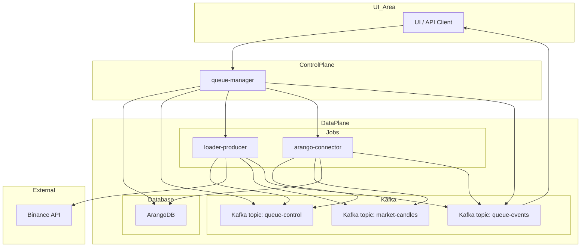

+++
date = '2025-08-25T10:01:00+02:00'
draft = false
title = 'Архитектура приложения StreamForge'
weight = 1
+++

# Часть II: Архитектура приложения StreamForge

### Статус сервиса

| Сервис | Версия | Сборка | Тест | Развертывание |
| :--- | :---: | :---: | :--: | :----: |
| **queue-manager** |  |  |  |  |
| **dummy-service** |  |  |  |  |
| **arango-connector** |  |  |  |  |
| **loader-api-candles** |  |  |  |  |
| **loader-api-trades** |  |  |  |  |

### **Глава 2: Высокоуровневая архитектура приложения**

#### **2.1. Ключевые принципы**

Архитектура StreamForge построена на трех фундаментальных принципах, обеспечивающих ее гибкость, надежность и готовность к будущим вызовам.

1.  **Декаплинг (Decoupling) через события:**
    Компоненты системы не связаны жесткими зависимостями. Вместо прямых API-вызовов, которые создают хрупкие связи, все взаимодействие происходит асинхронно через брокер сообщений Kafka. `queue-manager` не знает, где и как запущен `loader-producer`; он лишь публикует "приказ" в топик `queue-control`. Любой воркер, соответствующий критериям, может взять этот приказ в работу. Это позволяет независимо разрабатывать, обновлять и масштабировать каждый микросервис, не затрагивая остальные части системы.

2.  **Масштабируемость (Scalability):**
    Платформа спроектирована для горизонтального масштабирования. Воркеры (`loader-*`, `arango-connector` и др.) являются stateless-приложениями, запускаемыми как Kubernetes Jobs. При увеличении нагрузки (например, при необходимости одновременной загрузки данных по сотням торговых пар) `queue-manager` просто создаст большее количество Jobs. Использование партиций в Kafka позволяет распараллелить обработку данных, а интеграция с **KEDA** (Kubernetes Event-driven Autoscaling) в будущем позволит автоматически масштабировать количество консьюмеров в зависимости от длины очереди в топике.

3.  **Наблюдаемость (Observability):**
    Понимание состояния распределенной системы критически важно. В StreamForge наблюдаемость обеспечивается тремя столпами:
    *   **Метрики:** Каждый микросервис экспортирует метрики в формате Prometheus, которые собираются и визуализируются в Grafana. Это позволяет отслеживать технические параметры (CPU, память) и бизнес-метрики (количество обработанных записей, задержки).
    *   **Логи:** Все логи собираются централизованно с помощью `Fluent-bit` и отправляются в `Elasticsearch`, где их можно анализировать и искать через `Kibana`.
    *   **Телеметрия (Бизнес-трейсинг):** Топик `queue-events` выступает в роли системы распределенного трейсинга на уровне бизнес-логики. Он позволяет отследить жизненный цикл каждой задачи от момента ее создания до успешного завершения или ошибки, проходя через все задействованные микросервисы.

#### **2.2. Архитектурная схема и поток данных**

Ниже представлена схема, иллюстрирующая взаимодействие ключевых компонентов системы в рамках выполнения задачи по исторической загрузке данных.



**Описание потока данных (Workflow):**
1.  **Инициация:** Пользователь через UI или API отправляет запрос на запуск workflow в `queue-manager`.
2.  **Сохранение состояния:** `queue-manager` создает запись о новом workflow в своей базе данных (ArangoDB) со статусом `pending`.
3.  **Декларация намерения:** `queue-manager` формирует и отправляет команду `start` в топик `queue-control`.
4.  **Запуск исполнителей:** `queue-manager` через Kubernetes API создает `Job` для каждого необходимого микросервиса (`loader-producer`, `arango-connector`).
5.  **Получение команды:** Запущенные микросервисы подписываются на `queue-control` и получают команду `start`.
6.  **Сбор данных:** `loader-producer` обращается к API Binance для получения данных.
7.  **Публикация данных:** `loader-producer` отправляет полученные данные в соответствующий топик данных в Kafka (например, `btc-klines-1m`).
8.  **Отправка телеметрии:** Оба воркера (`loader` и `arango-connector`) периодически отправляют события о своем статусе (например, `loading`, `records_written: 1000`) в топик `queue-events`.
9.  **Потребление данных:** `arango-connector` читает данные из топика.
10. **Сохранение данных:** `arango-connector` записывает данные в целевую коллекцию в ArangoDB.
11. **Обратная связь:** `queue-manager` слушает топик `queue-events`, чтобы обновлять статус workflow в своей базе данных и транслировать его в UI через WebSocket.

### **Глава 3: Коммуникационная модель на базе Kafka**

#### **3.1. Обоснование выбора событийно-ориентированного подхода**

Выбор Apache Kafka в качестве центральной нервной системы проекта не случаен. Событийно-ориентированная архитектура (Event-Driven Architecture, EDA) предоставляет ряд критически важных преимуществ по сравнению с традиционной моделью, основанной на прямых API-вызовах:

*   **Временной декаплинг (Temporal Decoupling):** Продюсер (например, `loader-producer`) и консьюмер (например, `arango-connector`) не обязаны быть онлайн одновременно. `loader` может отправить данные в Kafka и завершить свою работу. `arango-connector` может быть запущен позже и обработать эти данные, когда ему будет удобно.
*   **Отказоустойчивость:** Kafka выступает в роли персистентного буфера. Если сервис-консьюмер выходит из строя, сообщения не теряются, а остаются в топике до тех пор, пока консьюмер не будет перезапущен и не сможет продолжить обработку с того места, где остановился.
*   **Гибкость и расширяемость:** Добавление нового обработчика данных (например, сервиса для real-time алертинга) не требует изменения существующих компонентов. Достаточно создать новый микросервис, который будет подписываться на тот же топик с данными.

#### **3.2. Спецификация управляющих топиков**

Вся оркестрация и мониторинг в StreamForge построены на двух служебных топиках.

##### **Топик `queue-control`**

*   **Назначение:** Декларативная отправка команд от `queue-manager` к воркерам.
*   **Продюсеры:** `queue-manager`.
*   **Консьюмеры:** Все воркеры (`loader-*`, `arango-connector`, `graph-builder` и т.д.).
*   **Формат сообщения:**
    ```json
    {
      "command": "start" | "stop",
      "queue_id": "wf-btcusdt-api_candles_5m-20240801-a1b2c3",
      "target": "loader-producer",
      "symbol": "BTCUSDT",
      "type": "api_candles_5m",
      "time_range": "2024-08-01:2024-08-02",
      "kafka_topic": "wf-btcusdt-api_candles_5m-20240801-a1b2c3-data",
      "collection_name": "btcusdt_api_candles_5m_2024_08_01",
      "telemetry_id": "loader-producer__a1b2c3",
      "image": "registry.dmz.home/streamforge/loader-producer:v0.2.0",
      "timestamp": 1722500000.123
    }
    ```

##### **Топик `queue-events`**

*   **Назначение:** Централизованный сбор телеметрии от всех микросервисов. Является "пульсом" системы.
*   **Продюсеры:** Все воркеры.
*   **Консьюмеры:** `queue-manager` (для обновления статусов и трансляции в UI).
*   **Формат сообщения:**
    ```json
    {
      "queue_id": "wf-btcusdt-api_candles_5m-20240801-a1b2c3",
      "producer": "arango-connector__a1b2c3",
      "symbol": "BTCUSDT",
      "type": "api_candles_5m",
      "status": "loading" | "finished" | "error" | "started" | "interrupted",
      "message": "Сохранено 15000 записей",
      "records_written": 15000,
      "finished": false,
      "timestamp": 1722500125.456
    }
    ```

### **Глава 4: Детальное описание микросервисов**

Платформа StreamForge состоит из набора специализированных, независимых микросервисов, каждый из которых выполняет четко определенную функцию.

#### **4.1. `queue-manager`: Центральный оркестратор**

`queue-manager` является "мозгом" всей системы. Это единственный компонент, с которым напрямую взаимодействует пользователь или внешняя система. Он отвечает за оркестрацию рабочих процессов (workflow), управление их жизненным циклом, а также за взаимодействие с другими микросервисами через Kafka и Kubernetes.

*   **Роль и обязанности:**
    *   **Точка входа:** Предоставляет REST API (на базе FastAPI) для управления жизненным циклом задач (workflows): запуск, остановка, получение статуса.
    *   **Оркестрация:** Принимает высокоуровневые запросы, декомпозирует их на конкретные шаги и генерирует команды для каждого воркера.
    *   **Управление состоянием:** Хранит состояние всех запущенных и завершенных workflows в базе данных ArangoDB.
    *   **Интеграция с Kubernetes:** Взаимодействует с Kubernetes API для динамического создания `Job` для каждого воркера в workflow.
    *   **Обратная связь:** Подписывается на топик телеметрии `queue-events`, чтобы отслеживать прогресс выполнения задач в реальном времени и обновлять их статус в UI через WebSocket.

*   **API Эндпоинты:**
    *   `POST /queues/start`: Запускает новую очередь (workflow). Принимает детальную конфигурацию для каждого микросервиса, участвующего в workflow.
        ```json
        {
          "command": "start",
          "queue_id": "loader-btcusdt-api_candles_5m-2024_06_01-abc123",
          "symbol": "BTCUSDT",
          "type": "api_candles_5m",
          "time_range": "2024-06-01:2024-06-02",
          "timestamp": 1722346211.177,
          "targets": [
            {
              "target": "loader-producer",
              "image": "registry.dmz.home/kinga/stream-forge/loader-producer:v0.1.0",
              "telemetry_id": "loader-producer__abc123",
              "kafka_topic": "loader-btcusdt-api-candles-5m-2024-06-01-abc123",
              "time_range": "2024-06-01:2024-06-02",
              "interval": "5m"
            },
            {
              "target": "arango-connector",
              "image": "registry.dmz.home/kinga/stream-forge/arango-connector:v0.1.0",
              "telemetry_id": "arango-connector__abc123",
              "kafka_topic": "loader-btcusdt-api-candles-5m-2024-06-01-abc123",
              "collection_name": "btc_candles_5m_2024_06_01"
            }
          ]
        }
        ```
    *   `POST /queues/start-test-flow`: Запускает предопределенный тестовый data-flow на основе шаблонов из `test_flows.yaml`. Упрощает запуск сложных тестовых сценариев.
        ```json
        {
          "flow_name": "historical_candles_to_arango",
          "symbol": "ETHUSDT",
          "time_range": "2024-07-01:2024-07-02",
          "extra_params": {
            "loader_image_version": "v0.1.1"
          }
        }
        ```
    *   `GET /queues/list`: Возвращает список всех запущенных и завершенных очередей.
    *   `POST /queues/stop`: Останавливает указанную очередь, отправляя команду `stop` в Kafka.

*   **Технологии:** Python, FastAPI, Pydantic, `python-kubernetes`, `aiokafka`, ArangoDB.


#### **4.2. Слой сбора данных: Семейство `loader-*`**

Эти микросервисы отвечают за получение данных из внешних источников (Binance) и их публикацию в Kafka. Они спроектированы как stateless-воркеры, запускаемые в виде Kubernetes Jobs.

*   **`loader-producer` (базовый)**
    *   **Роль:** Универсальный загрузчик данных из внешних источников (например, REST API Binance) и публикация их в Kafka.
    *   **Логика:** Работает асинхронно с использованием `asyncio` и `uvloop` для высокой производительности. Получает конфигурацию через переменные окружения. Слушает топик `queue-control` для команд управления (например, `stop`) и отправляет детальную телеметрию о своем статусе (`started`, `interrupted`, `finished`, `error`) в топик `queue-events`.
*   **`loader-api-*` (например, `loader-api-candles`, `loader-api-trades`)**
    *   **Роль:** Специализированные загрузчики исторических данных через REST API.
    *   **Логика:** Наследуют функциональность от базового `loader-producer`, фокусируясь на получении данных для конкретных типов (свечи, сделки) и временных диапазонов.
*   **`loader-ws-*` (например, `loader-ws-orderbook`)**
    *   **Роль:** Специализированные загрузчики данных в реальном времени через WebSocket.
    *   **Логика:** Устанавливают постоянное WebSocket-соединение с источником, получают поток событий и транслируют их в Kafka.
*   **Общие обязанности:**
    *   Получают всю конфигурацию (символ, тип данных, Kafka-топик и т.д.) через переменные окружения.
    *   Слушают топик `queue-control` для корректного завершения работы по команде `stop`.
    *   Отправляют детальную телеметрию о своей работе в `queue-events`.
*   **Технологии:** Python, `aiohttp` (для REST), `websockets` (для WebSocket), `aiokafka`, `uvloop`, `orjson`.

#### **4.3. Слой хранения данных: Семейство `arango-connector`**

Эти микросервисы выступают в роли моста между Kafka и базой данных ArangoDB.

*   **Роль и обязанности:**
    *   **Потребление данных:** Подписываются на определенный топик с данными в Kafka.
    *   **Пакетная запись:** Накапливают сообщения в буфере и записывают их в ArangoDB пачками (батчами) для повышения производительности.
    *   **Идемпотентность:** Используют операцию `UPSERT` и уникальный ключ `_key` для каждого документа, что гарантирует отсутствие дубликатов при повторной обработке сообщений.
    *   **Обработка ошибок:** Корректно обрабатывают невалидные сообщения (например, "битый" JSON), логируют их и продолжают работу, не останавливая весь конвейер.
*   **Технологии:** Python, `aioarango`, `aiokafka`.

#### **4.4. Аналитический слой: `graph-builder` и `gnn-trainer`**

Это наукоемкая часть платформы, отвечающая за продвинутый анализ данных и машинное обучение.

*   **`graph-builder`**
    *   **Роль:** Преобразование табличных данных (свечи, сделки) в графовую структуру.
    *   **Логика:** Читает данные из нескольких коллекций ArangoDB, рассчитывает корреляции или другие метрики взаимосвязи между активами и строит граф, где узлы — это торговые пары, а ребра — их взаимосвязи. Сохраняет результат в отдельную графовую коллекцию в ArangoDB.
*   **`gnn-trainer`**
    *   **Роль:** Обучение моделей графовых нейронных сетей (GNN).
    *   **Логика:** Загружает граф, построенный `graph-builder`. Определяет и обучает GNN-модель (например, на базе `GATv2Conv`) для решения задачи классификации или регрессии (например, прогнозирование движения цены). Сохраняет обученную модель и артефакты (например, веса, метрики обучения) в объектное хранилище `MinIO`.
*   **Технологии:** Python, `aioarango`, `PyTorch`, `PyTorch Geometric (PyG)`, `minio-py`.

#### **4.5. `dummy-service`: Микросервис для тестирования и симуляции**

`dummy-service` — это тестовый микросервис StreamForge, предназначенный для симуляции поведения других сервисов, тестирования связности Kafka и отладки. Он может получать команды из `queue-control`, отправлять события в `queue-events`, имитировать загрузку и ошибки, а также публиковать Prometheus-метрики.

*   **Роль и обязанности:**
    *   **Симуляция:** Имитирует работу других микросервисов (например, `loader-producer`) для тестирования сквозных сценариев без реальных данных.
    *   **Тестирование Kafka:** Используется для проверки связности с Kafka через команды `ping/pong`.
    *   **Отладка:** Позволяет имитировать различные состояния (загрузка, ошибка) для отладки системы мониторинга и оркестрации.
    *   **Метрики:** Экспортирует Prometheus-метрики для наблюдения за его поведением.
*   **Технологии:** Python, FastAPI, `aiokafka`, `loguru`, `prometheus_client`.
*   **Подробнее:** См. `services/dummy-service/README.md`.

