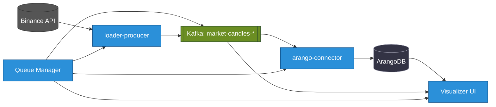

+++
date = '2025-06-13T20:14:52+02:00'
draft = true
title = 'Архитектура аналитики криптовалютных данных в реальном времени'
weight = 1
+++

### Статус сервиса

| Сервис | Версия | Сборка | Тест | Развертывание |
| :--- | :---: | :---: | :--: | :----: |
| **queue-manager** |  |  |  |  |
| **dummy-service** |  |  |  |  |
| **arango-connector** |  |  |  |  |
| **loader-api-candles** |  |  |  |  |
| **loader-api-trades** |  |  |  |  |

# StreamForge: Высокопроизводительная, событийно-ориентированная платформа для аналитики криптовалютных данных в реальном времени

**StreamForge** — это передовая, событийно-ориентированная платформа, разработанная для высокопроизводительного приема, обработки и анализа рыночных данных криптовалют в реальном времени. Основанная на современных облачных технологиях и архитектурных паттернах, StreamForge представляет собой масштабируемое, отказоустойчивое и гибкое решение для решения уникальных задач в области цифровых активов.

## Обзор архитектуры

## 1.1. Проблема криптовалютных данных

В быстро меняющемся мире цифровых активов криптовалютные данные являются жизненной силой аналитики и автоматизированного принятия решений. Эти данные характеризуются чрезвычайной волатильностью, круглосуточной доступностью и огромным объемом, охватывая все: от высокочастотных сделок до непрерывных обновлений книги ордеров. Эти характеристики требуют нового поколения конвейеров данных — не только высокопроизводительных, но и исключительно надежных.

Ключевые технические препятствия включают:
- **Гетерогенный прием данных:** Интеграция разрозненных потоков данных из множества источников, включая REST API для исторических данных и каналы WebSocket для рыночных событий в реальном времени.
- **Экстремальная масштабируемость:** Проектирование системы, способной обрабатывать массивные, пиковые потоки данных без введения задержек.
- **Целостность данных и отказоустойчивость:** Обеспечение гарантированной доставки данных и проектирование для быстрого, автоматизированного восстановления после сбоев компонентов.
- **Оркестровка сложных рабочих процессов:** Управление сложными, многоэтапными рабочими процессами обработки данных, такими как последовательность «загрузка -> сохранение -> построение графа -> обучение модели», скоординированным и надежным образом.

## 1.2. Решение StreamForge: разделенная, событийно-ориентированная архитектура

StreamForge спроектирован как полностью событийно-ориентированная платформа, разработанная с нуля для максимальной эффективности и отказоустойчивости. Основным принципом является полное разделение сервисов через центральную нервную систему: **Apache Kafka**. Вместо прямых, хрупких вызовов между сервисами компоненты обмениваются данными асинхронно. Каждый микросервис является автономной единицей, которая публикует события (свою работу).

Применение этого подхода гарантирует высокую масштабируемость, адаптируемость к изменяющимся требованиям и повышенную отказоустойчивость всей системы.

## 1.3. Миссия проекта

1.  **Создание единого источника данных:** Консолидация процессов сбора, проверки и хранения рыночных данных для обеспечения оперативного и удобного доступа к высококачественной информации.
2.  **Формирование инновационной среды для науки о данных:** Предоставление специализированной платформы для разработки, тестирования и валидации аналитических моделей, включая передовые архитектуры графовых нейронных сетей (GNN).
3.  **Создание надежной основы для алгоритмической торговли:** Разработка высокопроизводительного и отказоустойчивого конвейера данных, критически важного для функционирования автоматизированных торговых систем.
4.  **Комплексная автоматизация процессов:** Минимизация ручного вмешательства на всех этапах жизненного цикла данных, от сбора до аналитической обработки, для повышения операционной эффективности.

## 1.4. Практические примеры использования

- **Сценарий 1: Обучение модели на исторических данных.**
  - **Цель:** Обучить модель GNN на ретроспективных данных о транзакциях и агрегированных 5-минутных свечах для торговой пары `BTCUSDT` за последний месячный период.
  - **Метод:** Полный цикл обработки данных активируется через `queue-manager`. Задачи выполняются Kubernetes Jobs: `loader-producer` загружает данные в Apache Kafka, `arango-connector` обеспечивает их постоянное хранение в ArangoDB, `graph-builder` формирует структуру графа, а `gnn-trainer` выполняет обучение модели.

- **Сценарий 2: Мониторинг рынка в реальном времени.**
  - **Цель:** Получать потоковые данные о транзакциях и состоянии книги ордеров в реальном времени для торговой пары `ETHUSDT`.
  - **Метод:** Модуль `loader-ws` устанавливает соединение с WebSocket и передает данные в Apache Kafka. Разрабатываемый модуль визуализации подписывается на соответствующие топики для отображения данных на интерактивной панели.

- **Сценарий 3: Быстрый анализ данных.**
  - **Цель:** Проверить гипотезу о корреляции между объемами торгов и волатильностью рынка.
  - **Метод:** Использование `Jupyter Server` для установления соединения с ArangoDB и проведения аналитических исследований на основе данных, уже агрегированных и обработанных системой StreamForge.

Эти мощные функциональные возможности делают StreamForge незаменимым инструментом для всех, кто стремится к максимальной эффективности в работе с криптовалютными данными.

## Образы контейнеров

Следующие образы Docker публикуются в GitHub Container Registry (GHCR):

| Сервис | Статус | Образ | Команда для скачивания |
|---|---|---|---|
| dummy-service |  | `ghcr.io/0leh-kondratov/dummy-service:latest` | `docker pull ghcr.io/0leh-kondratov/dummy-service:latest` |
| streamforge-base |   | `ghcr.io/0leh-kondratov/stream-forge-base:v0.1.3` | `docker pull ghcr.io/0leh-kondratov/stream-forge-base:v0.1.3` |

---